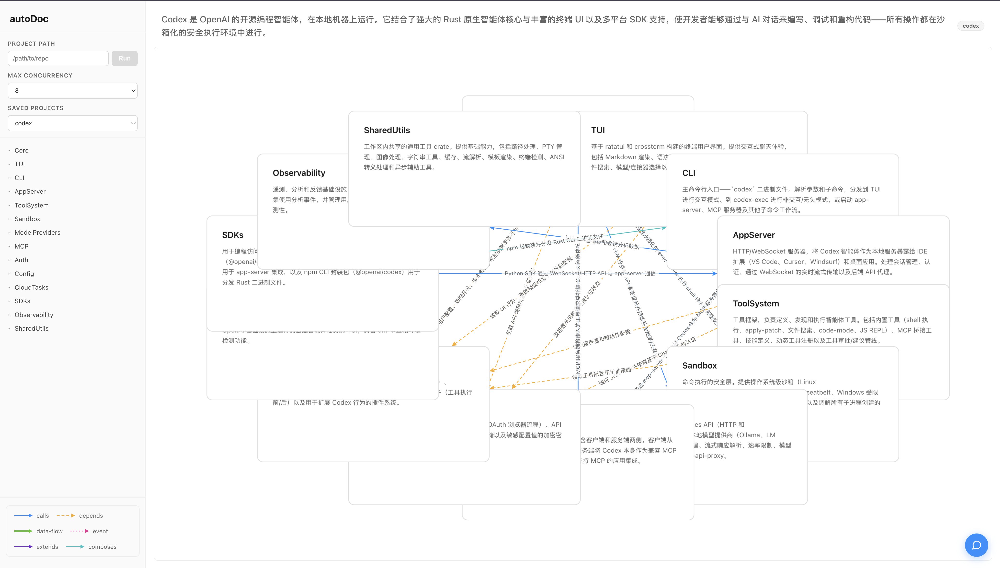
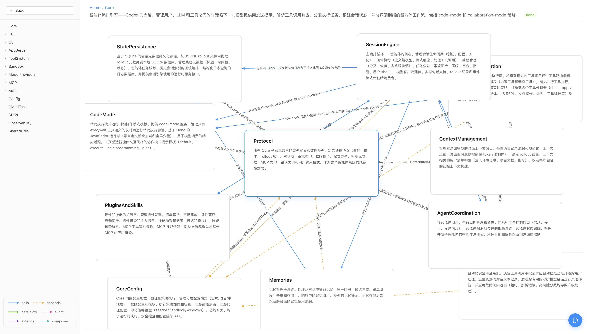
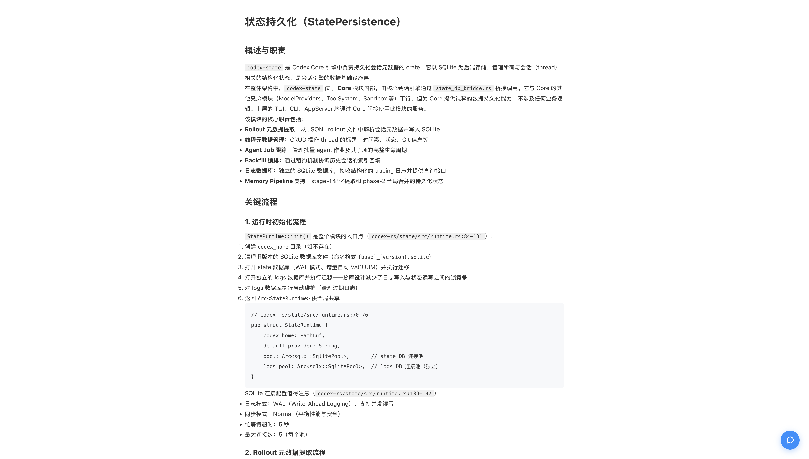
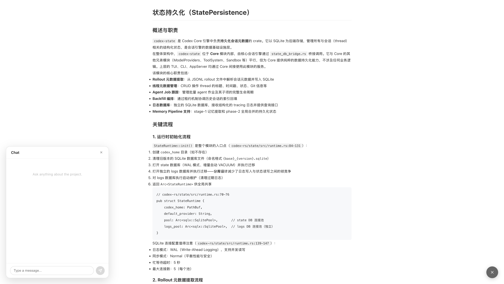
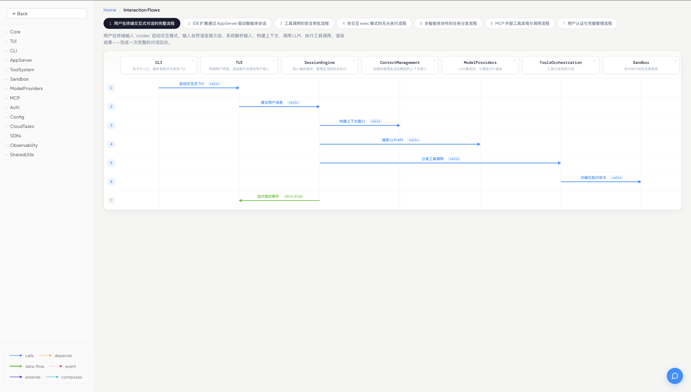

<p align="center">
  <picture>
    
  </picture>
</p>

<h3 align="center">
  Agent ネイティブなコード知識基盤——インタラクティブ・増分更新・Agent が直接読み書きできる自己索引ドキュメントサイト
</h3>

<p align="center">
| <a href="docs/USAGE.md"><b>Documentation</b></a> | <a href="https://github.com/Haruhiko-Joe/skills/tree/main/doc-drill"><b>doc-drill Skill</b></a> | <a href="https://github.com/Haruhiko-Joe/autoDoc/issues"><b>Issues</b></a> | <a href="README.md"><b>中文</b></a> | <a href="README.en.md"><b>English</b></a> |
</p>

<p align="center">
  
  
  
  
  
  <a href="https://github.com/Haruhiko-Joe/autoDoc/stargazers"></a>
</p>

## なぜ ACCEED なのか？

> ドキュメントサイトの三大規範は、可読性、対話性、保守性。その中でも可読性は、人間とエージェントがコードを理解するための最も基本的な要件であり、ソフトウェアエンジニアリングの領域においては、あらゆる開発活動に優先する前提条件とされております。ドキュメントを読むことにより、開発者はコードベースの全体像を把握でき、さらに、そのドキュメントが構造化された階層ナビゲーションと型付きモジュール関係を提供する場合、その理解は質的な飛躍を遂げます。また、この究極のドキュメント体験の追求に全情熱を傾ける開発者とエージェントが存在します——そしてこの執念を受け止めるドキュメント体系を、一般的に**知識基盤**と呼びます。ACCEED は、世の中にありふれたフラットテキスト、ファイルごとのコメント、浅い RAG 検索断片に飽きてしまわれた開発者とエージェントの方々に、その素質にふさわしい知識基盤を提供しております。

| | ACCEED | DeepWiki | Google Code Wiki |
|---|:---:|:---:|:---:|
| マルチ Agent 反復検証 | **✅ 5 Agent + Checker ループ** | ❌ 単発生成 | ❌ 単発生成 |
| git URL 直接接続 | **✅ バックエンドが自動 clone & commit 追跡** | ✅ | ✅ |
| 増分更新（git diff 駆動） | **✅ 専用 Updater Agent が局所更新** | ❌ 全体再生成 | ❌ 全体再生成 |
| インタラクティブ架構図 | **✅ 6 種セマンティックエッジ + ホバー詳細** | ❌ 静的 Mermaid | ❌ 静的 |
| 再帰的適応分解 | **✅ Agent が深度を自律決定** | ❌ 固定階層 | ❌ フラット |
| クラッシュリカバリ | **✅ Session ID + pending ステージング** | ❌ | ❌ |
| Agent によるドキュメント書き込み | **✅ HTTP MCP（query + mutate + 履歴）** | ❌ | ❌ |
| Code Agent 統合 | **✅ doc-drill skill ↔ /mcp** | ❌ | ❌ |
| ハイブリッド AI バックエンド | **✅ ロールごとに Claude/Codex 選択可** | ❌ | ❌ |

## デモ

| アーキテクチャ総覧 | サブモジュール関係図 |
|:---:|:---:|
|  |  |

| Markdown ドキュメントページ | AI への質問 |
|:---:|:---:|
|  |  |

| インタラクションフロー |
|:---:|
|  |

## クイックスタート

```bash
git clone https://github.com/Haruhiko-Joe/autoDoc.git
cd autoDoc
pnpm install && cd web && pnpm install && cd ..
pnpm start
```

フロントエンドで git URL を貼り付けると生成が始まります。**前提条件・初回生成・増分更新・MCP 接続などの完全な手順は [USAGE.md](docs/USAGE.md) を参照してください。**

### Codex Profile 設定

Codex バックエンドは Agent ロール毎に [profiles](https://developers.openai.com/codex/config-reference) を分けてモデルパラメータを隔離します。`~/.codex/config.toml` に各 role の profile を追加してください。名前は必ず `scaffold`、`decomposer`、`writer`、`checker`、`flowanalyzer`、`prupdater`、`knowledge` にします:

```toml
[profiles.scaffold]
model = "gpt-5.4"
model_reasoning_effort = "high"

[profiles.decomposer]
model = "gpt-5.4"
model_reasoning_effort = "high"

[profiles.writer]
model = "gpt-5.4"
model_reasoning_effort = "medium"

[profiles.checker]
model = "gpt-5.4"
model_reasoning_effort = "high"

[profiles.flowanalyzer]
model = "gpt-5.4"
model_reasoning_effort = "medium"

[profiles.prupdater]
model = "gpt-5.4"
model_reasoning_effort = "high"

[profiles.knowledge]
model = "gpt-5.4"
model_reasoning_effort = "medium"
```

必要に応じてモデルを差し替えたり、`model_reasoning_effort` / `service_tier` を調整可能です。全キーは公式 [Config Reference](https://developers.openai.com/codex/config-reference) を参照してください。

## 仕組み

### 初回投入: 全量パイプライン

```
gitUrl ──► git clone ──► src/souko/repo/{name}
                                  │
                                  ▼
              Scaffold ──► Checker
                                  │
                ┌─────────────────┴─────────────────┐
                ▼                                   ▼
          Decomposer ──► Checker            Decomposer ──► Checker  ...
                │                                   │
                ▼                                   ▼
             Writer                              Writer
                │                                   │
                └───────► Assemble MCP / Skill ◄────┘
                                       │
                                       ▼
                                Flow Analyzer
                                       │
                                       ▼
                       projects.json + src/souko/doc/{name}
```

### 増分更新: PR 駆動

```
手動トリガー POST /api/update/start
         │
         ▼
  UpdateOrchestrator (プロジェクト単位ロック)
         │
  git fetch origin main → lastProcessedSha (カーソル) 読取
         │
  ┌──────┴───────┐
  │ GitHub 項目   │ 非 GitHub
  │ gh pr list   │ git log
  │ --state merged│ --first-parent
  └──────┬───────┘
         │
    PR/Commit キュー (時系列昇順)
         │
    各タスクを直列処理:
      PrUpdater Agent + MCP ツール
         │
  ┌──────┴───────┐
  │ Auto モード   │ Manual モード
  │ → done       │ → awaiting-review
  │ → 次へ       │ → Accept / フォローアップ
  └──────────────┘
         │
    カーソル更新 → 次のタスクへ
```

| Agent | 役割 | 検証 |
|-------|------|------|
| **Scaffold** | リポジトリ全体を分析し、トップレベルモジュールグラフを生成 | Checker で検証 |
| **Decomposer** | モジュールをサブグラフまたはリーフページに再帰的に分割 | Checker で検証（最大 5 回リトライ） |
| **Writer** | 各リーフノードに詳細な Markdown を生成 | — |
| **Checker** | Scaffold と Decomposer が生成したグラフ構造の完全性を検証 | — |
| **Flow Analyzer** | 3–7 件の典型的なモジュール間インタラクションフローを抽出 | — |
| **PrUpdater** | PR 単位で MCP ツール経由でドキュメントを自律ナビゲーションし、標的修正を実行（影響評価 → 検索 → patch_page / update_page） | 手動レビューゲート（Manual モード） |

全量 Agent は **Arranger** ステートマシンにより統合管理され、**スライディングウィンドウ型並行モデル**を採用します——並行セッション数はフロントエンドから設定可能（デフォルト 8）。ノードごとに状態を管理し、クラッシュリカバリを完全サポート。**PrUpdater** は独立した増分チャネルで、PR 単位で動作します：Agent は commit メタデータ + diff を受け取り、MCP ツール（`get_top` → `search_nodes` → `get_page` → `patch_page`）でドキュメントツリーを自律ナビゲーションし、標的修正を行います。Manual モードでは各 PR がユーザーレビューゲートを通過し、セッション継続による反復微調整をサポートします。

### ハイブリッド AI バックエンド

各 Agent ロールは **Claude**（Claude Agent SDK）または **Codex**（OpenAI Codex SDK）を独立して選択可能。フロントエンドの設定パネルから個別に調整できます:

| ロール | デフォルトバックエンド |
|--------|----------------------|
| Scaffold | Codex |
| Decomposer | Codex |
| Writer | Codex |
| Checker | Claude |
| Flow Analyzer | Codex |
| Updater | Codex |

## 主な機能

- **🔗 git URL ワンクリック接続** — SSH/HTTPS git URL を入力するだけで、バックエンドが自動 clone・メインブランチの commit を追跡、すべて `src/souko/` 以下に集約
- **🔁 PR 単位の増分更新** — `gh pr list`（または `git log` フォールバック）で新たにマージされた全 PR を自動検出し、PrUpdater Agent が MCP ツール経由で標的修正を実行。Auto モードは完全自動、Manual モードはレビューゲート + セッション継続による反復微調整付き
- **🧭 分解レビューゲート** — Scaffold / Decomposer の出力後に任意で一時停止し、グラフを直接編集・承認、またはフィードバック付きで再分解できます
- **🧠 Knowledge Elicitor** — 初回生成前に Agent と会話して `knowledge.md` を作成し、ドメイン背景や分解方針を下流 Agent に注入できます
- **🛰️ HTTP MCP サーバー** — 同一プロセスの `/mcp` エンドポイント（Streamable HTTP）が query + mutate の全ツールを公開、Code Agent から直接読み書き可能
- **📜 手動 Git commit と blame** — ドキュメント書き込みは未コミット変更だけを作成し、Git パネルで dirty 状態確認・手動 commit・preview/editing での blame 表示を行います
- **🔗 インタラクティブ有向グラフ** — [AntV G6](https://g6.antv.antgroup.com/) ベース、6 種のセマンティックエッジ（呼び出し、依存、データフロー、イベント、継承、コンポジション）対応、ホバー詳細、ノードフィルター、focus モードを搭載
- **🔍 段階的開示** — トップレベル概要から、ノードをクリックしてリーフの Markdown まで階層的に掘り下げ
- **🔄 インタラクションフロー図** — モジュール横断のビジネスフローを自動抽出し、参加者・ステップ・コード参照付きシーケンス図として描画
- **🔎 モジュール検索** — サイドバーから全モジュールを高速検索
- **💬 AI チャットパネル** — フローティングチャットでドキュメント内容に追加質問（`OPENAI_API_KEY` が必要）
- **🌙 ダークモード** — 低ノイズなダーク UI
- **📊 リアルタイム進捗** — ホーム画面で生成進捗をライブ表示（initial / incremental / noop の 3 モードを区別）
- **🌐 多言語** — 中国語（デフォルト）または英語のドキュメントサイトを生成

## HTTP MCP インターフェース

バックエンドは `http://localhost:3100/mcp` にステートレス Streamable HTTP transport で `acceed` という MCP サーバーを公開します。すべてのツールは `src/souko/doc/{project}/` 以下の実ファイルを操作します。

### Claude Code / Codex への接続

ターゲットリポジトリのルートに `.mcp.json` を置くだけ:

```json
{
  "mcpServers": {
    "acceed": {
      "type": "http",
      "url": "http://localhost:3100/mcp"
    }
  }
}
```

Codex は project-scoped `.codex/config.toml` を使います。ACCEED は skill assemble 時に同等の設定を書き込みます:

```toml
[mcp_servers.acceed]
url = "http://localhost:3100/mcp"
enabled_tools = ["list_projects", "get_top", "get_flows", "get_graph", "get_page", "search_nodes", "list_source_files", "read_source_files", "list_docs", "read_docs", "patch_page", "update_page", "update_node", "update_graph_meta", "create_node", "delete_node", "update_top"]
```

対応する [doc-drill skill](src/skill-template/SKILL.md) は **MCP ツールの呼び出し方だけ**を記述した薄い説明書で、ACCEED と一緒に配布されます。

### ツール一覧

#### Query（副作用なし）

| ツール | 用途 |
|---|---|
| `list_projects` | 利用可能な doc project を列挙（name / description） |
| `get_top` | プロジェクトの top.json を取得 |
| `get_flows` | 典型的なモジュール間フローを読み、代表ケースで協調動作を理解 |
| `get_graph` | サブグラフを取得（`codeScope`、`nodes`、`description`） |
| `get_page` | リーフの Markdown ページを読む |
| `search_nodes` | 全階層を横断してノード名・説明をキーワード検索 |
| `list_source_files` / `read_source_files` | regex でソースを探して読む |
| `list_docs` / `read_docs` | nodeId で文書原文を一括列挙/読み取り |

#### Mutate（プロジェクト単位の lock で直列化）

| ツール | 用途 |
|---|---|
| `update_top` | top.json の description / nodes を更新 |
| `update_graph_meta` | サブグラフの description / codeScope を更新 |
| `create_node` | 親グラフに新ノードを追加（page → 空 md も同時作成、graph → サブグラフのプレースホルダも作成） |
| `update_node` | 親グラフ内ノードの name / description / codeScope / edges を更新 |
| `delete_node` | 親グラフからノードを削除（page なら md を削除、graph ならサブツリーを再帰削除） |
| `patch_page` | リーフ md 内の局所テキストを文字列マッチ＆置換で精密編集、update_page より効率的で安全 |
| `update_page` | リーフ md を上書き |

書き込みフロー: **read → mutate tool が working tree を変更 → frontend Git panel で dirty 状態を確認 → ユーザーが手動 commit**。mutate tool はドキュメント working tree の変更だけを残します。並行書き込みは project-level lock で直列化されます。

> ⚠️ `/mcp` はデフォルトで無認証・CORS 開放です。本番運用前にアクセス制御を追加するかループバックにバインドしてください。

## プロジェクトストア

すべてのプロジェクトのソースコードとドキュメントは `src/souko/` 配下に集約されます:

```
src/souko/
├── projects.json        # 共有 registry: { name → { sourceUrl, branch, head, lastUpdated } }
├── repo/                # git clone されたソース（プロジェクト毎にサブディレクトリ、gitignore）
│   ├── openclaw/
│   └── ...
└── doc/                 # 生成されたドキュメントサイト（プロジェクト毎にサブディレクトリ、gitignore）
    ├── openclaw/
    │   ├── top.json
    │   ├── flows.json
    │   ├── {Module}/
    │   │   ├── {Module}.json
    │   │   ├── {Leaf}.md
    │   │   └── {SubModule}/...
    │   └── ...
    └── ...
```

## プラガブルなドキュメント

各モジュールのドキュメントは自己完結型の独立ユニットです。編集方法は 3 通り:

- **MCP ツール経由**（推奨）: `update_node` / `update_page` / `create_node` / `delete_node` — ドキュメント working tree を変更し、frontend Git panel で手動 commit します
- **ファイルを直接編集**: `src/souko/doc/{project}/` 以下の `.md` / `.json` を直接編集、refresh で反映され未コミット変更として表示されます
- **増分更新のトリガー**: ホーム画面で Update ボタンをクリックすると、PrUpdater Agent が新しくマージされた全 PR を自動検出し、1 件ずつ処理します。Manual モードでは各 PR がレビュー確認ゲートを通過します

## doc-drill: Code Agent ネイティブ統合

初期ドキュメント内容が完成した時点で、ACCEED はスリム版 [doc-drill](src/skill-template/SKILL.md) skill をターゲットリポジトリの `.codex/skills/doc-drill/SKILL.md` に自動インストールし、Claude Code 用の `.mcp.json` と Codex 用の `.codex/config.toml` にローカル HTTP MCP サーバーへの参照を書き込みます。この時点で `get_flows` は登録済みですが、Flow Analyzer が `flows.json` を書き込むまでは flow 未生成を通知し、書き込み後は同じツールでエンドツーエンド flow を取得できます。任意の Code Agent がこれを通じて:

- **段階的ブラウジング** — `list_projects` → `get_top` → `get_graph` → `get_page`、lazy load でコンテキスト節約
- **関係追跡** — 6 種のセマンティックエッジに沿ってモジュール間のコールチェーンとデータフローを追跡
- **キーワード検索** — `search_nodes` で全ドキュメント階層を横断検索
- **ビジネスフローナビ** — `get_flows` / `flows.json` を通じてエンドツーエンドのインタラクションシナリオを理解
- **直接メンテナンス** — mutate ツールでドキュメントをその場で追加削除変更し、最後に ACCEED frontend の Git panel で手動 commit

> これは DeepWiki（Web チャットのみ）や Google Code Wiki（Web ブラウジングのみ）にはない、Agent ネイティブな統合能力です。

## 技術スタック

| レイヤー | 技術 |
|----------|------|
| バックエンド | TypeScript, [Claude Agent SDK](https://docs.anthropic.com/en/docs/claude-code), [OpenAI Codex SDK](https://github.com/openai/codex-sdk), [@modelcontextprotocol/sdk](https://github.com/modelcontextprotocol/typescript-sdk), Zod |
| Git サブシステム | child_process から直接 `git` CLI を呼び出し、サードパーティ git 依存なし |
| フロントエンド | Vue 3, TypeScript, AntV G6, Vite |
| AI チャット | OpenAI API（gpt-4o またはカスタムモデル） |
| モノレポ | pnpm workspaces |

## プロジェクト構成

```
ACCEED/
├── src/
│   ├── server.ts                 # HTTP API + /mcp（同一ポート、stateless transport）
│   ├── git/
│   │   ├── repoManager.ts        # git CLI ラッパー（clone / fetch / diff / projectNameFromUrl）
│   │   └── prDiscovery.ts         # GitHub PR / git log による増分タスク検出
│   ├── souko/                    # プロジェクトストア（repo + doc + 共有 registry）
│   │   ├── registry.ts           # projects.json 読み書き
│   │   ├── repo/                 # gitignore: clone 済みソース
│   │   ├── doc/                  # gitignore: 生成されたドキュメントサイト
│   │   └── projects.json         # gitignore: 共有 registry
│   ├── mcp/                      # HTTP MCP サーバー（HTTP API と同一プロセス）
│   │   ├── server.ts             # buildMcpServer(store)
│   │   ├── docStore.ts           # ドキュメント読み書き + project-level lock
│   │   ├── docGit.ts             # doc Git status / commit / blame
│   │   ├── schema.ts             # Zod schemas
│   │   └── tools/{query,mutate}.ts
│   ├── agents/                   # Agent 実装（Claude + Codex 双方）
│   │   ├── tsukai/               # 全 Agent クラス（barrel: index.ts）
│   │   │   ├── claude{scaffold,decomposer,writer,checker,flowanalyzer,prupdater}.ts
│   │   │   └── codex{scaffold,decomposer,writer,checker,flowanalyzer,prupdater}.ts
│   │   ├── instructions/         # Agent プロンプト
│   │   │   ├── cn/               # 中国語プロンプト
│   │   │   └── en/               # 英語プロンプト
│   │   └── schemas/schema.ts     # Zod 出力スキーマ（UpdaterOutput 含む）
│   ├── workflow/
│   │   ├── arranger.ts           # 全量パイプラインステートマシン
│   │   └── updateOrchestrator.ts # PR 駆動の増分更新オーケストレーター
│   └── skill-template/
│       └── SKILL.md              # スリム版 doc-drill skill（/mcp を指す）
├── web/                          # Vue 3 フロントエンド
│   └── src/
│       ├── views/                # HomePage, GraphPage（グラフ + 文書プレビュー/編集）, FlowsPage, KnowledgePage
│       ├── components/           # ChatPanel 等
│       └── services/doc.ts       # API クライアント（run/status/doc/search/chat/update/knowledge/doc-git）
├── package.json
└── pnpm-workspace.yaml
```

## Contributing

本プロジェクトはプロトタイプ段階にあり、頻繁に破壊的変更が発生する可能性があります。新機能の提案については、ロードマップとの整合のため、まず Issue で相談してください。個人開発者による二次開発を歓迎しますが、[LICENSE](LICENSE)（AGPL-3.0）の制約に従ってください。

本プロジェクトは「AGPL-3.0 オープンソース + 商用ライセンス」のデュアルライセンスモデルを採用しているため、外部からのすべてのコントリビューションはマージ前に [CLA](docs/CLA.md) への署名が必要です。初回 PR 提出時に CLA Assistant が署名手順を自動的に案内し、一度の署名で以降のすべてのコントリビューションがカバーされます。

**すべての Issue は中国語で提出してください**。中国語以外の言語で提出された Issue は、返信することなくクローズされます。

Issue や Pull Request を歓迎します！ACCEED が役に立ったら、ぜひ Star をお願いします。

## License & 商用ライセンス

ACCEED は法的にデュアルライセンスモデルを採用しています：

- **オープンソースライセンス**：[GNU AGPL-3.0-only](LICENSE)。無償で使用・改変・再配布が可能ですが、**改変版または派生物（ネットワーク経由でサービスとして提供されるデプロイを含む）は、対応する完全なソースコードを AGPL-3.0 の下でそのサービスのすべてのユーザーに公開しなければなりません**（AGPL-3.0 §13）。
- **商用ライセンス**：AGPL-3.0 のコピーレフト義務を履行できない／履行したくない場合（例：ACCEED をクローズドソース製品に組み込む、派生ソースを公開せずに SaaS として外部提供するなど）、事前に作者の書面による商用ライセンスを取得する必要があります。詳細は [COMMERCIAL-LICENSE.md](docs/COMMERCIAL-LICENSE.md) を参照。

### 商用ライセンスの取得方法

本プロジェクトの商用ライセンスは、使用企業の規模に応じて以下の 2 階層で付与されます：

**第一階層：時価総額または直近評価額が 10 億人民元未満の企業**

従業員に本リポジトリへ Star を付けてもらい、プロジェクトへの公的な承認とします。**当該企業の従業員と識別可能な GitHub アカウントから付けられた Star 5 個につき、当該企業に 1 年間の商用ライセンスが付与されます**。Star は雇用主として当該企業を識別できる GitHub アカウント（公開プロフィールに雇用主が記載されている、または会社メールで認証されている）から付けられる必要があります。ライセンス期間は最終の該当 Star の日から起算し、期限切れ後は再度累積が必要です。

**第二階層：時価総額または直近評価額が 10 億人民元以上の企業**

作者に対し正式な採用通知（オファー）を発行する必要があります。日常実習（インターンシップ）のオファーも有効です。付与ルールは以下の通り：

1. **作者が何らかの形で当該企業に入社した場合、当該企業は自動的に永久商用ライセンスを取得します**。入社前および入社後のすべての使用・改変・配布・派生物を対象とします。
2. **作者が入社しないことはライセンス拒否を意味しません**。作者はポジション・base・勤務地などを総合的に評価して入社可否を判断しますが、最終的に入社しない場合でも、オファー自体が**誠実で、市場合理性を備え、本プロジェクトへの評価を明確に示している**限り、同様に永久商用ライセンスを付与します。
3. 作者は最終解釈権を留保します。明らかに市場水準を下回る、または不合理な条件が付随するオファーは有効な対価を構成しません。

### お問い合わせ

- **商用ライセンス・オファー**：`joeyanbo608@gmail.com`
- **推奨件名**：`[ACCEED Commercial License] <貴社名>` または `[ACCEED Offer] <貴社名>`

初回連絡時には、会社名・規模・想定用途・予定デプロイ範囲を明記してください。該当階層の判定および後続フローの案内に使用します。
