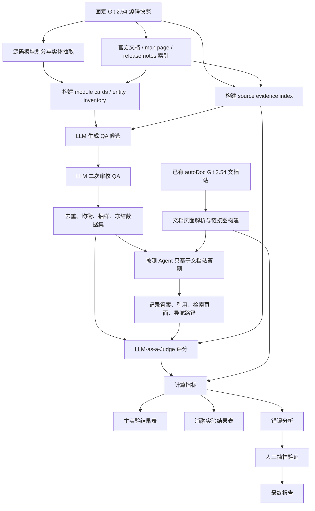

# AutoDoc-Bench: 面向自动生成文档站的 Benchmark 设计

> 设计依据：autoDoc 的公开 README 将其定位为“面向任意代码仓库生成交互式文档站”的工具，并展示了架构总览、子模块关系图、Markdown 文档页、AI 追问与交互流程图等文档站形态。([GitHub][1]) 本项目任务说明要求调研 benchmark/metric、定义 autoDoc 专属评测协议、选择 baseline、运行主实验与消融分析。
> AutoDoc-Bench 借鉴 SWD-Bench 的思想：基于真实软件仓库，通过 QA / 定位 / 补全等可验证任务评估仓库级软件文档的实际效用，而不是只评价文本观感。SWD-Bench 明确提出以功能驱动 QA 任务评估文档是否帮助理解仓库，并包含 functionality detection、localization、completion 三类任务。([arXiv][2])
> 首轮实验默认使用已经由 autoDoc 生成完成的 Git 2.54 文档站；Git v2.54 的 release notes 可作为版本特定任务与版本一致性检查的重要参考来源。([GitHub][3]) Git 官方文档 / man page 体系也可作为可选参考证据或 baseline 语料。([Git][4])

---

## 1. Benchmark 目标

AutoDoc-Bench 是一个面向自动生成文档站的仓库级 benchmark，目标不是简单判断“文档写得是否流畅”，而是评估文档站是否真的能帮助开发者或 agent 理解、定位、解释和使用一个复杂代码仓库。

对于 autoDoc 这类系统，文档质量至少包含两层能力：

1. **生成质量**：文档是否正确、覆盖充分、结构合理、跨页面一致。
2. **使用质量**：用户或 agent 是否能通过文档站快速找到信息，并基于文档完成技术问答、源码理解和开发者任务。

因此 AutoDoc-Bench 将文档站作为一个可交互知识环境来评测，核心评估以下八个方面：

| 维度         | 评测目标                                 | 为什么适合 autoDoc                          |
| ---------- | ------------------------------------ | -------------------------------------- |
| 文档正确性      | 文档是否与 Git 2.54 源码、命令行为、配置、API、数据结构一致 | autoDoc 从代码自动生成文档，最关键风险是生成看似合理但事实错误的说明 |
| 文档覆盖率      | 是否覆盖核心模块、命令、配置项、流程、关键文件和数据结构         | 仓库级文档站必须有全局覆盖能力，而不是只解释少量文件             |
| QA 可回答性    | 用户只依赖文档站能否回答 Git 2.54 技术问题           | 直接衡量文档的实际使用价值                          |
| 可定位性 / 导航性 | 能否快速找到相关页面、标题、段落和链接路径                | 文档站不仅要有内容，还要能被找到                       |
| 跨文档一致性     | 多个页面对同一概念、命令、模块、配置项的描述是否一致           | 自动生成文档容易在不同页面产生重复、漂移或矛盾                |
| 版本一致性      | 文档是否反映 Git 2.54，而不是旧版本或未来版本          | Git 版本间行为差异明显，版本漂移会严重影响可信度             |
| 文档结构质量     | 页面层级、目录、标题、链接、模块组织是否合理               | autoDoc 输出的是“文档站”，结构质量本身就是产品质量         |
| 面向开发者的实用性  | 是否能帮助开发者理解源码结构、核心流程、扩展方式和调试入口        | 文档站的最终价值是降低开发者理解大型仓库的成本                |

AutoDoc-Bench 的核心原则：

* **真实仓库**：首轮使用 Git 2.54。
* **真实任务**：围绕命令、配置、源码模块、数据结构、跨文件流程、版本变化构造问题。
* **LLM 自动构造 QA**：不依赖大量人工手写 QA。
* **LLM-as-a-Judge 自动评分**：答案判定使用 evidence-grounded LLM Judge，而不是字符串匹配。
* **证据可追溯**：每个 QA 必须绑定源码、官方文档、man page 或 release notes 证据。
* **评测可复现**：记录模型、prompt、版本、索引、chunk、检索参数、随机种子和运行产物。

---

## 2. 被测对象与实验输入

### 2.1 被测对象

| 项目     | 说明                                                                     |
| ------ | ---------------------------------------------------------------------- |
| 被测系统   | autoDoc                                                                |
| 被测文档站  | autoDoc 已经生成完成的 Git 2.54 文档站                                           |
| 被测仓库   | `git/git`                                                              |
| 被测版本   | Git 2.54                       |
| 扩展目标   | 未来可扩展到 Git 其他版本、其他大型 C/C++/Rust/Go/JavaScript 仓库、多版本文档站比较              |

### 2.2 输入数据

AutoDoc-Bench 首轮 Git 2.54 实验使用以下输入：

| 输入                                         | 用途                                     | 是否给被测 agent 访问                       |
| ------------------------------------------ | -------------------------------------- | ------------------------------------ |
| Git 2.54 源码                                | 构建 gold evidence、模块划分、源码事实验证、版本特定任务    | autoDoc 主实验条件下不允许访问                  |
| autoDoc 生成的 Git 2.54 文档站                   | 被测文档站；用于 agent 检索、导航、回答                | autoDoc 主实验条件下唯一允许访问的知识源             |
| Git 官方文档 / man pages / README / 源码注释       | 作为 gold evidence 的辅助来源；也作为 baseline 语料 | 仅在对应 baseline 条件下允许访问                |
| Git 2.54 release notes / v2.53..v2.54 diff | 生成版本特定 QA、版本陷阱、行为变化问题                  | 主实验 agent 不允许访问                      |
| LLM 生成的 QA 数据集                             | benchmark 测试集                          | 只向 agent 提供 question，不提供 gold answer |
| LLM Judge 评分结果                             | 自动评分、错误分析、指标计算                         | 不给 agent 访问                          |
| 人工抽样审核记录                                   | 校准 benchmark 可信度                       | 不给 agent 访问                          |

### 2.3 数据边界

在 autoDoc 主实验条件下，agent 只能使用：

```text
autoDoc Git 2.54 文档站
autoDoc 文档站页面索引
autoDoc 文档站内部链接
autoDoc 文档站页面标题、正文、代码块、图表转写文本
```

agent 不允许使用：

```text
Git 2.54 源码
Git 官方文档
man pages
GitHub / Web 搜索
模型预置知识作为未引用事实
autoDoc 生成过程中的隐藏中间数据
未公开的生成 prompt 或缓存
```

如果 autoDoc 文档站包含自己的“AI 追问”功能，建议将其作为单独实验条件 `AutoDoc-SiteChat`，不要混入标准 `AutoDoc-StaticDocs` 主实验。标准主实验只评估文档站静态内容和链接结构。

---

## 3. Benchmark 总体流程

AutoDoc-Bench 的总体流程分为数据构建、答题评测、指标计算、实验分析四个阶段。



### 3.1 流程步骤

#### Step 1：仓库与文档站准备

主实验不重新生成 Git 2.54 autoDoc 文档站，只做以下准备：

1. 固定 Git 2.54 源码快照：

   * `repo = git/git`
   * `version = 2.54`
   * `tag = v2.54.0`
   * `commit_hash = <git rev-parse HEAD>`
2. 固定已有 autoDoc 文档站：

   * `doc_site_path = data/docs/autodoc_git_2.54/`
   * 记录文档站生成时间、文件哈希、页面数量、链接数量。
3. 将 Git 源码、官方文档、man pages、release notes 仅用于：

   * QA gold answer 生成
   * evidence 校验
   * baseline 语料
   * Judge 参考证据

#### Step 2：源码模块划分

生成 `module_cards.jsonl`，每条描述一个 Git 2.54 模块或实体集合，例如：

```json
{
  "module_id": "object-database",
  "name": "Object Database",
  "source_files": ["object-file.c", "object-name.c", "odb.c", "object-store-ll.h"],
  "headers": ["object.h", "object-store.h"],
  "commands": ["cat-file", "hash-object", "fsck"],
  "data_structures": ["struct object_id", "struct object_database", "struct packed_git"],
  "configs": ["core.repositoryformatversion", "extensions.objectFormat"],
  "tests": ["t/t1006-cat-file.sh", "t/t1450-fsck.sh"],
  "importance_weight": 0.95
}
```

模块划分来源：

* 目录结构
* `builtin/*.c` 命令入口
* 头文件和核心结构体
* 调用关系 / include 关系
* Git 官方文档目录
* release notes 中涉及的变更
* 测试文件覆盖情况
* LLM 对源码模块职责的归纳

#### Step 3：文档页面索引

对 autoDoc 文档站做结构化解析，生成：

```text
doc_pages.jsonl
doc_chunks.jsonl
doc_links.jsonl
doc_headings.jsonl
doc_entities.jsonl
```

每个页面至少解析：

```json
{
  "page_id": "autodoc:git-2.54:object-database",
  "path": "docs/core/object-database.md",
  "title": "Object Database",
  "headings": [
    {"level": 1, "text": "Object Database", "anchor": "#object-database"},
    {"level": 2, "text": "Key Data Structures", "anchor": "#key-data-structures"}
  ],
  "out_links": ["docs/core/revision-walk.md", "docs/api/object-id.md"],
  "in_links": ["docs/architecture.md"],
  "entities": ["object_id", "packed_git", "oid_object_info"],
  "content_hash": "sha256:..."
}
```

#### Step 4：QA 对自动生成

使用 LLM 根据 Git 2.54 源码、官方文档、release notes、模块信息、commit diff 自动生成 QA 候选。

生成结果包括：

* question
* gold_answer
* evidence
* expected_doc_pages
* scoring_rubric
* category
* difficulty
* version_guard

#### Step 5：QA 对质量过滤

使用另一个 LLM 对 QA 候选做二次审核：

* 问题是否清晰
* gold answer 是否完全由 evidence 支持
* evidence 是否具体到路径和行号
* 是否存在幻觉
* 是否重复
* 难度是否合理
* 是否适合评测文档站

#### Step 6：Agent 基于文档站回答问题

对每个 QA：

1. agent 接收 question。
2. agent 只能检索 autoDoc 文档站。
3. agent 返回 answer。
4. agent 必须输出引用页面、段落、标题、检索 trace。
5. 若文档站缺失信息，agent 应明确说明“无法从文档站确定”。

#### Step 7：LLM Judge 自动评分

Judge 输入：

* question
* gold_answer
* scoring_rubric
* gold evidence
* model_answer
* retrieved_doc_pages
* cited snippets

Judge 输出：

* 0-5 分维度评分
* 综合分
* pass / fail
* error_tags
* unsupported_claims
* missing_points
* version_error 判断

#### Step 8：指标计算

计算：

* QA Accuracy
* Avg Judge Score
* Evidence Recall
* Evidence Precision
* Page Hit Rate
* Coverage Score
* Hallucination Rate
* Version Error Rate
* Navigation Success Rate
* Cross-document Consistency Score
* 可选：Developer Utility Score、Structure Quality Score、MRR@K

#### Step 9：主实验对比

将 autoDoc 文档站与多个 baseline 对比：

1. autoDoc 生成文档站
2. Git 官方文档 / man pages
3. README + 源码注释
4. 仅源码检索
5. 无文档 RAG baseline
6. 人工或半人工文档 upper bound，可选

#### Step 10：消融实验

在可计算资源允许时，对 autoDoc 生成流程做 ablation，生成若干变体文档站，再使用同一套 QA 和 Judge 评测。

#### Step 11：错误分析

自动统计错误类型，并对高频错误做人工抽样复核。

---

## 4. 数据集构建

### 4.1 数据集文件

建议首轮 Git 2.54 数据集产物：

```text
data/git-2.54/
  module_cards.jsonl
  entity_inventory.jsonl
  qa_raw.jsonl
  qa_filtered.jsonl
  qa_test.jsonl
  qa_dev.jsonl
  qa_stress.jsonl
  evidence.jsonl
  consistency_items.jsonl
  navigation_items.jsonl
```

### 4.2 QA 数据 schema

基础 schema：

```json
{
  "id": "git-2.54-core-001",
  "repo": "git/git",
  "version": "2.54",
  "category": "core-concept | command | config | api | data-structure | workflow | architecture | edge-case",
  "difficulty": "easy | medium | hard",
  "question": "...",
  "gold_answer": "...",
  "evidence": [
    {
      "type": "source_code | official_doc | autodoc_page | man_page",
      "path": "...",
      "line_range": "...",
      "quote_or_summary": "..."
    }
  ],
  "expected_doc_pages": [
    "..."
  ],
  "scoring_rubric": {
    "must_include": [],
    "should_include": [],
    "must_not_include": []
  }
}
```

### 4.3 推荐扩展 schema

为了支持版本一致性、导航评测、错误分析和复现实验，建议扩展为：

```json
{
  "id": "git-2.54-workflow-037",
  "repo": "git/git",
  "version": "2.54",
  "source_tag": "v2.54.0",
  "source_commit": "<commit_hash>",
  "category": "workflow",
  "sub_category": "revision-walk",
  "difficulty": "hard",
  "question_type": "cross_file_trace",
  "question": "In Git 2.54, how does the revision walking machinery decide which commits are excluded when processing negative revisions?",
  "gold_answer": "The answer should explain ...",
  "evidence": [
    {
      "type": "source_code",
      "path": "revision.c",
      "line_range": "L1234-L1298",
      "quote_or_summary": "Shows how negative revisions are marked and propagated."
    },
    {
      "type": "source_code",
      "path": "commit.c",
      "line_range": "L456-L512",
      "quote_or_summary": "Shows commit flag handling relevant to traversal."
    }
  ],
  "expected_source_files": [
    "revision.c",
    "commit.c",
    "list-objects.c"
  ],
  "expected_doc_pages": [
    "docs/core/revision-walk.md",
    "docs/data-structures/commit.md"
  ],
  "version_guard": {
    "valid_for": "2.54",
    "derived_from": "source_snapshot",
    "version_specific": true,
    "must_not_confuse_with": [
      "behavior in versions before v2.54 if changed",
      "features added after v2.54"
    ]
  },
  "scoring_rubric": {
    "must_include": [
      "negative revisions are represented through commit flags or equivalent exclusion state",
      "the traversal logic propagates exclusion through parent relationships where applicable",
      "answer names the relevant subsystem or files"
    ],
    "should_include": [
      "mention revision.c",
      "mention interaction with object traversal or commit list handling"
    ],
    "must_not_include": [
      "claims that Git simply filters commits after traversal with no flag propagation",
      "claims about features added after Git 2.54"
    ]
  },
  "metadata": {
    "generator_model": "gpt-x",
    "generator_prompt_version": "qa_generation_v1",
    "filter_model": "gpt-y",
    "filter_prompt_version": "qa_filter_v1",
    "created_at": "2026-05-19T00:00:00+09:00"
  }
}
```

### 4.4 字段说明

| 字段                                | 含义                                                   |
| --------------------------------- | ---------------------------------------------------- |
| `id`                              | QA 唯一 ID，建议格式为 `{repo}-{version}-{category}-{index}` |
| `repo`                            | 被测仓库，首轮为 `git/git`                                   |
| `version`                         | 被测版本，首轮为 `2.54`                                      |
| `source_tag`                      | 源码 tag，例如 `v2.54.0`                                  |
| `source_commit`                   | 源码 commit hash，用于复现                                  |
| `category`                        | 问题大类，例如 command、config、workflow                      |
| `sub_category`                    | 更细粒度主题，例如 revision-walk、object-database              |
| `difficulty`                      | easy / medium / hard                                 |
| `question_type`                   | 具体 QA 类型，例如 concept_explain、cross_file_trace         |
| `question`                        | 给被测 agent 的问题                                        |
| `gold_answer`                     | 标准答案，由 LLM 基于 evidence 生成并通过二次审核                     |
| `evidence`                        | 支撑 gold answer 的证据列表                                 |
| `expected_source_files`           | 理想答案应能涉及的源码文件，主要用于开发者实用性和定位评估                        |
| `expected_doc_pages`              | autoDoc 文档站中预期应命中的页面；若文档站缺失，可为空并在覆盖率中计为缺失            |
| `version_guard`                   | 版本一致性约束，防止答成旧版本或未来版本                                 |
| `scoring_rubric.must_include`     | 正确答案必须包含的要点                                          |
| `scoring_rubric.should_include`   | 高质量答案应包含的补充要点                                        |
| `scoring_rubric.must_not_include` | 出现即应扣分或判错的内容                                         |
| `metadata`                        | 生成、过滤、版本、时间等复现信息                                     |

### 4.5 数据规模建议

首轮 Git 2.54 推荐规模：

| 阶段           |     数量 | 说明                         |
| ------------ | -----: | -------------------------- |
| QA 候选生成      |   1200 | 10 类问题 × 多模块 × 多难度         |
| LLM filter 后 | 700 左右 | 过滤证据不足、重复、含糊问题             |
| dev 集        |     60 | prompt 调参、Judge 校准，不进入最终排名 |
| test 集       |    600 | 主实验正式评测                    |
| stress 集     | 80-120 | hard、跨文件、版本陷阱、边界条件         |
| 人工抽样         | 50-100 | QA 质量与 Judge 可信度验证         |

---

## 5. QA 对生成设计

QA 对必须全部通过 LLM 自动生成。人工只做抽样验证与争议仲裁。

### 5.1 QA 类型

|  # | QA 类型         | 适合评估什么                | 输入上下文                                          | 首轮目标数量，filtered | 难度控制                                    |
| -: | ------------- | --------------------- | ---------------------------------------------- | --------------: | --------------------------------------- |
|  1 | 概念解释型问题       | 核心概念、术语、模块职责是否解释清楚    | 模块卡片、官方文档、相关源码注释                               |              60 | easy：单概念；medium：概念与模块关系；hard：概念跨多个子系统   |
|  2 | 命令行为型问题       | Git 命令参数、边界行为、输出语义    | `builtin/*.c`、`Documentation/git-*.adoc`、tests |              80 | easy：单选项；medium：选项组合；hard：异常路径或版本新增行为   |
|  3 | 配置项说明型问题      | 配置项含义、默认值、影响范围        | `Documentation/config/*`、config 读取代码、tests     |              60 | easy：含义；medium：作用域；hard：与命令行为交互         |
|  4 | 源码模块理解型问题     | 模块职责、关键文件、入口函数        | module cards、源码文件、include/call graph           |              70 | easy：模块职责；medium：关键文件；hard：模块间协作        |
|  5 | 数据结构理解型问题     | struct 字段、生命周期、所有权、用途 | 头文件、核心 C 文件、源码注释                               |              50 | easy：结构体用途；medium：字段语义；hard：跨模块状态变化     |
|  6 | 跨文件流程追踪型问题    | 复杂流程是否可由文档串联          | 调用链、tests、多个源码文件                               |              80 | easy：2 文件；medium：3-4 文件；hard：多阶段流程和异常路径 |
|  7 | 版本特定问题        | 文档是否反映 Git 2.54       | release notes、`v2.53..v2.54` diff、源码           |              60 | easy：新增命令/选项；medium：行为变化；hard：旧行为与新行为对比 |
|  8 | 边界条件 / 错误处理问题 | 文档是否解释异常输入、失败路径       | tests、error handling code、man page             |              50 | easy：明确错误；medium：特殊状态；hard：稀有边界条件       |
|  9 | 文档导航型问题       | 能否找到正确页面、段落、链接路径      | autoDoc 页面索引、标题、实体映射                           |              40 | easy：直接页面；medium：通过链接找到；hard：跨层级定位      |
| 10 | 对比型问题         | 相近概念、命令、模块是否区分清楚      | 两个或多个模块 / 命令 / 配置项                             |              50 | easy：两个概念；medium：命令差异；hard：实现层差异        |

总计：约 600 条 filtered test QA。

### 5.2 QA 生成流程

#### 5.2.1 构建上下文包

每次调用 LLM 生成 QA 前，先构建 `context_pack`：

```json
{
  "repo": "git/git",
  "version": "2.54",
  "module": {
    "module_id": "refs",
    "name": "References",
    "source_files": ["refs.c", "refs/files-backend.c", "refs/reftable-backend.c"],
    "headers": ["refs.h", "refs/refs-internal.h"],
    "related_commands": ["update-ref", "show-ref", "for-each-ref"],
    "related_configs": []
  },
  "source_snippets": [
    {
      "path": "refs.c",
      "line_range": "L100-L180",
      "content": "..."
    }
  ],
  "official_doc_snippets": [
    {
      "path": "Documentation/git-update-ref.adoc",
      "line_range": "L1-L90",
      "content": "..."
    }
  ],
  "release_note_snippets": [
    {
      "path": "Documentation/RelNotes/2.54.0.adoc",
      "line_range": "L236-L308",
      "content": "..."
    }
  ],
  "commit_diff_summary": [
    {
      "commit": "...",
      "summary": "...",
      "files_changed": ["..."]
    }
  ],
  "autodoc_page_candidates": [
    {
      "path": "docs/core/refs.md",
      "title": "References",
      "summary": "..."
    }
  ]
}
```

注意：

* `source_snippets`、`official_doc_snippets`、`release_note_snippets` 用于生成 gold answer。
* `autodoc_page_candidates` 只用于填写 `expected_doc_pages`，不能作为 gold answer 的唯一证据。
* 对于版本特定问题，必须包含 Git 2.54 release notes 或 v2.53..v2.54 diff summary。

#### 5.2.2 QA 生成 System Prompt

```text
You are an expert benchmark designer for repository-level software documentation evaluation.

Your task is to generate high-quality QA items for AutoDoc-Bench.
The benchmark evaluates whether an automatically generated documentation site helps developers understand a real code repository.

You must follow these rules:

1. Generate questions that are answerable from the provided evidence.
2. The gold answer must be fully supported by the provided source code, official documentation, man page, release note, test, or diff evidence.
3. Do not invent facts, functions, commands, options, configs, file paths, behaviors, or version changes.
4. If the evidence is insufficient, output an empty list.
5. Prefer questions that evaluate documentation quality: correctness, coverage, navigation, consistency, version specificity, and developer usefulness.
6. Each QA item must contain concrete evidence with path and line range.
7. The question must not reveal the full answer.
8. The question should be useful for evaluating whether a user or agent can answer using a documentation site.
9. For hard questions, require multi-hop reasoning across files, modules, commands, configs, or version changes.
10. For version-specific questions, explicitly anchor the question to the target version and include must_not_include items that catch old-version or future-version behavior.
11. Output valid JSON only. Do not output Markdown.
```

#### 5.2.3 QA 生成 User Prompt

```text
Generate QA items for AutoDoc-Bench.

Repository: {repo}
Target version: {version}
Source tag or commit: {source_ref}

QA category: {category}
Target difficulty distribution:
- easy: {num_easy}
- medium: {num_medium}
- hard: {num_hard}

Question type requirements:
{question_type_requirements}

Context pack:
{context_pack_json}

Definitions:

Difficulty:
- easy: answer can be supported by one primary evidence item and one concept/page.
- medium: answer requires combining two evidence items or distinguishing related commands/configs/modules.
- hard: answer requires cross-file reasoning, version-specific behavior, edge cases, or multi-step workflow tracing.

Evidence requirements:
- Every QA item must include at least one evidence item.
- Medium items should include at least two evidence items when possible.
- Hard items must include at least two evidence items, preferably from different files or evidence types.
- Evidence must include path and line_range.
- quote_or_summary must explain exactly what the evidence supports.
- autoDoc pages may be listed as expected_doc_pages, but they must not be the only evidence for gold_answer.

Output JSON schema:

{
  "items": [
    {
      "id": "TEMP_ID",
      "repo": "{repo}",
      "version": "{version}",
      "source_tag": "{source_ref}",
      "category": "{category}",
      "sub_category": "...",
      "difficulty": "easy | medium | hard",
      "question_type": "...",
      "question": "...",
      "gold_answer": "...",
      "evidence": [
        {
          "type": "source_code | official_doc | man_page | release_note | test",
          "path": "...",
          "line_range": "Lx-Ly",
          "quote_or_summary": "..."
        }
      ],
      "expected_source_files": ["..."],
      "expected_doc_pages": ["..."],
      "version_guard": {
        "valid_for": "{version}",
        "version_specific": true,
        "derived_from": "source_snapshot | release_notes | diff | official_doc",
        "must_not_confuse_with": ["..."]
      },
      "scoring_rubric": {
        "must_include": ["..."],
        "should_include": ["..."],
        "must_not_include": ["..."]
      },
      "quality_notes": {
        "why_this_tests_documentation": "...",
        "expected_reasoning_steps": ["..."]
      }
    }
  ]
}

Additional constraints:
- Do not generate duplicate questions.
- Avoid trivia that does not test documentation quality.
- Avoid questions whose answer is a single obvious filename unless question_type is navigation or localization.
- Avoid subjective wording such as "is this good" or "why is Git designed well".
- Prefer questions that would expose missing pages, wrong command behavior, poor navigation, or inconsistent module descriptions.
- If the provided evidence does not support enough QA items, generate fewer items.
```

#### 5.2.4 QA 输出示例

```json
{
  "items": [
    {
      "id": "TEMP_ID",
      "repo": "git/git",
      "version": "2.54",
      "source_tag": "v2.54.0",
      "category": "command",
      "sub_category": "history",
      "difficulty": "medium",
      "question_type": "command_behavior",
      "question": "In Git 2.54, what is the intended use of the experimental `git history split` operation, and how does it differ from using a general interactive rebase?",
      "gold_answer": "A correct answer should explain that `git history split` is an experimental history rewriting operation for splitting a selected commit by interactively choosing hunks, aimed at simpler targeted rewrites. It should distinguish it from the more general and open-ended `git rebase -i`, including that `git history` is designed for targeted operations and has limitations such as not supporting histories with merge commits.",
      "evidence": [
        {
          "type": "release_note",
          "path": "Documentation/RelNotes/2.54.0.adoc",
          "line_range": "L236-L290",
          "quote_or_summary": "Release notes mention the addition of experimental git history and its split subcommand."
        },
        {
          "type": "official_doc",
          "path": "Documentation/git-history.adoc",
          "line_range": "L1-L120",
          "quote_or_summary": "The command documentation describes history split behavior and limitations."
        }
      ],
      "expected_source_files": ["builtin/history.c", "replay.c"],
      "expected_doc_pages": ["docs/commands/git-history.md", "docs/workflows/history-rewriting.md"],
      "version_guard": {
        "valid_for": "2.54",
        "version_specific": true,
        "derived_from": "release_notes",
        "must_not_confuse_with": [
          "describing git history as a stable non-experimental command",
          "claiming it is equivalent to full interactive rebase"
        ]
      },
      "scoring_rubric": {
        "must_include": [
          "experimental command in Git 2.54",
          "split selected commit by choosing hunks or equivalent description",
          "targeted/simple history rewrite use case",
          "difference from general interactive rebase"
        ],
        "should_include": [
          "limitations around merge commits or conflict-producing operations",
          "relationship to replay machinery"
        ],
        "must_not_include": [
          "claim that git history is available in older Git versions without qualification",
          "claim that it supports arbitrary interactive rebase todo lists"
        ]
      }
    }
  ]
}
```

### 5.3 QA 质量过滤

QA 质量过滤由另一个 LLM 完成，建议使用不同模型或至少不同 prompt，并设置 `temperature = 0`。

#### 5.3.1 过滤标准

每条 QA 必须满足：

| 检查项            | 通过标准                                          |
| -------------- | --------------------------------------------- |
| 问题清晰           | 问题有明确对象、版本、范围，不含歧义                            |
| gold answer 可证 | gold answer 的每个关键事实均能从 evidence 支持            |
| evidence 具体    | 证据必须有路径、行号或稳定段落定位                             |
| 无幻觉            | 不引入 evidence 中没有的函数、配置、行为、版本变化                |
| 不重复            | 与已有 accepted QA 不构成语义重复                       |
| 难度合理           | easy / medium / hard 标签与推理复杂度匹配               |
| 适合文档站评测        | 问题应能暴露文档正确性、覆盖率、导航性或实用性                       |
| 版本一致           | 对 Git 2.54 的描述不能混入旧版本或未来版本                    |
| 答案非纯记忆         | 不是“Git 是什么”这类过于通用的问题                          |
| rubric 可执行     | must_include / must_not_include 可被 Judge 用来评分 |

#### 5.3.2 QA Filter Prompt

```text
You are a strict QA quality auditor for AutoDoc-Bench.

Your job is to decide whether a generated QA item is valid for evaluating an automatically generated documentation site for a real software repository.

You must verify:
1. The question is clear and unambiguous.
2. The gold_answer is fully supported by the evidence.
3. Every important factual claim in the gold_answer can be traced to evidence.
4. The evidence is specific enough: path + line_range or stable section reference.
5. The item does not hallucinate functions, commands, configs, files, APIs, or version behavior.
6. The item is not a duplicate of similar existing items.
7. The difficulty label is appropriate.
8. The item is useful for testing documentation quality.
9. The scoring rubric is concrete and judgeable.
10. The item is anchored to the target version when version-specific.

Scoring:
- clarity: 0-5
- evidence_support: 0-5
- evidence_specificity: 0-5
- hallucination_risk: 0-5 where 0 means no risk and 5 means severe risk
- duplicate_risk: 0-5 where 0 means unique and 5 means duplicate
- difficulty_fit: 0-5
- benchmark_value: 0-5
- version_consistency: 0-5

Decision rules:
- Accept only if clarity >= 4, evidence_support >= 4, evidence_specificity >= 4, difficulty_fit >= 4, benchmark_value >= 4, version_consistency >= 4, hallucination_risk <= 1, duplicate_risk <= 2.
- Revise if the item is valuable but has minor wording or rubric issues.
- Reject if evidence is insufficient, hallucination risk is high, or the question is not useful for documentation evaluation.

Input:
Target repo: {repo}
Target version: {version}

Candidate QA item:
{candidate_json}

Evidence snippets:
{evidence_context_json}

Similar accepted items:
{similar_items_json}

Output valid JSON only:

{
  "id": "...",
  "decision": "accept | revise | reject",
  "scores": {
    "clarity": 0,
    "evidence_support": 0,
    "evidence_specificity": 0,
    "hallucination_risk": 0,
    "duplicate_risk": 0,
    "difficulty_fit": 0,
    "benchmark_value": 0,
    "version_consistency": 0
  },
  "issues": [
    {
      "type": "clarity | evidence | hallucination | duplicate | difficulty | version | rubric | benchmark_value",
      "severity": "minor | major | critical",
      "description": "..."
    }
  ],
  "revised_item": null,
  "acceptance_reason": "...",
  "rejection_reason": "..."
}
```

#### 5.3.3 去重策略

自动去重分三层：

1. **文本归一化去重**

   * lowercase
   * 去掉标点
   * 命令名、函数名、配置项标准化
2. **向量相似度去重**

   * 对 question + gold_answer embedding
   * 相似度超过阈值，例如 `cosine >= 0.88`，进入候选重复集合
3. **LLM 语义去重**

   * 对候选重复集合调用 LLM 判断：

     * 是否问同一事实
     * 是否只是措辞变化
     * 是否覆盖不同难度或不同角度

#### 5.3.4 数据集均衡

过滤后按照以下维度做均衡：

```text
category
difficulty
module
command
config
source_file
question_type
version_specific
edge_case
```

避免数据集被少数命令或少数模块主导。

---

## 6. 被测 Agent 答题协议

### 6.1 标准答题条件

AutoDoc-Bench 定义标准被测条件：

```text
Condition name: AutoDoc-StaticDocs
Accessible corpus: autoDoc generated Git 2.54 documentation site only
Internet: disabled
Git source code: forbidden
Official docs / man pages: forbidden
Hidden generation metadata: forbidden
LLM pretrained knowledge: allowed only as language ability, not as uncited factual source
```

### 6.2 Agent 可访问内容

agent 可以访问：

| 内容                             | 是否允许             |
| ------------------------------ | ---------------- |
| autoDoc 文档页面正文                 | 允许               |
| autoDoc 页面标题、目录、heading、anchor | 允许               |
| autoDoc 内部链接                   | 允许               |
| autoDoc 页面中的代码片段               | 允许               |
| 文档站搜索索引                        | 允许               |
| 文档站链接图                         | 允许               |
| 文档站图片的文字转写                     | 允许，需记录转写方式       |
| autoDoc 自带 AI chat             | 标准主实验不允许；可作为单独条件 |

### 6.3 Agent 不可访问内容

| 内容                    | 是否允许           |
| --------------------- | -------------- |
| Git 2.54 源码           | 不允许            |
| Git 官方文档 / man pages  | 不允许            |
| release notes         | 不允许            |
| GitHub / Web 搜索       | 不允许            |
| benchmark gold answer | 不允许            |
| benchmark evidence    | 不允许            |
| LLM Judge 输出          | 不允许            |
| QA 生成 prompt          | 不允许            |
| 自动生成文档时的中间摘要          | 不允许，除非已公开在文档站中 |

### 6.4 检索与导航记录

每次答题必须记录：

```json
{
  "question_id": "git-2.54-command-001",
  "retrieval_trace": [
    {
      "step": 1,
      "query": "git history split Git 2.54",
      "top_k": 8,
      "results": [
        {
          "rank": 1,
          "page_path": "docs/commands/git-history.md",
          "heading": "git history split",
          "score": 0.81
        }
      ]
    },
    {
      "step": 2,
      "action": "open_page",
      "page_path": "docs/commands/git-history.md",
      "anchor": "#split"
    }
  ],
  "retrieved_doc_pages": [
    "docs/commands/git-history.md",
    "docs/workflows/history-rewriting.md"
  ]
}
```

### 6.5 Agent 输出格式

agent 必须输出 JSON：

```json
{
  "id": "git-2.54-command-001",
  "answer": "...",
  "confidence": 0.0,
  "cannot_answer_from_docs": false,
  "citations": [
    {
      "page_path": "docs/commands/git-history.md",
      "heading": "Split",
      "anchor": "#split",
      "quote_or_summary": "The page states that ...",
      "line_range_or_paragraph": "P4-P6"
    }
  ],
  "retrieved_doc_pages": [
    "docs/commands/git-history.md",
    "docs/workflows/history-rewriting.md"
  ],
  "navigation_path": [
    "docs/index.md",
    "docs/commands/index.md",
    "docs/commands/git-history.md"
  ]
}
```

### 6.6 Agent Answering Prompt 模板

```text
You are an answering agent in AutoDoc-Bench.

You must answer questions using ONLY the provided autoDoc documentation site.
You are not allowed to use source code, official Git docs, man pages, web search, release notes, or any hidden knowledge.
Your answer must be grounded in retrieved documentation pages.

Rules:
1. Search and read the documentation pages before answering.
2. Cite the pages and sections that support your answer.
3. If the documentation does not contain enough information, say that the answer cannot be determined from the provided documentation.
4. Do not invent command behavior, config defaults, file names, function names, APIs, or version-specific facts.
5. Do not cite a page unless it actually supports the claim.
6. Prefer concise but complete answers.
7. For version-specific questions, only answer based on documentation that clearly applies to Git {version}.
8. For navigation questions, focus on the page, heading, and path a user should open.

Available tools:
- search_docs(query, top_k)
- open_page(page_path)
- follow_link(page_path, anchor)
- list_headings(page_path)

Question:
{question}

Target version:
{version}

Return valid JSON only:

{
  "id": "{question_id}",
  "answer": "...",
  "confidence": 0.0,
  "cannot_answer_from_docs": true,
  "citations": [
    {
      "page_path": "...",
      "heading": "...",
      "anchor": "...",
      "quote_or_summary": "...",
      "line_range_or_paragraph": "..."
    }
  ],
  "retrieved_doc_pages": ["..."],
  "navigation_path": ["..."],
  "notes": "..."
}
```

### 6.7 Baseline Agent 协议

所有 baseline 使用相同 answering model、相同 answer prompt、相同 Judge，只替换可访问 corpus：

| 条件                      | 允许访问语料                                     |
| ----------------------- | ------------------------------------------ |
| `AutoDoc-StaticDocs`    | autoDoc Git 2.54 文档站                       |
| `GitOfficialDocs`       | Git 2.54 官方文档、man pages、release notes      |
| `ReadmeComments`        | README、Documentation 中 overview 类文件、源码注释抽取 |
| `SourceOnly`            | Git 2.54 源码、测试、注释，但不访问 autoDoc 和官方文档       |
| `NoDoc-RAG`             | 空 corpus；agent 只能回答“无法从文档确定”或依靠模型先验，但不得引用  |
| `ManualDocs-UpperBound` | 人工或半人工文档；若不可获得，则作为 optional upper bound    |

---

## 7. LLM-as-a-Judge 答案判定协议

答案判定必须由 LLM 完成。为降低 LLM Judge 不稳定性，采用：

1. evidence-grounded Judge。
2. 结构化 rubric。
3. temperature = 0。
4. 同一答案可重复 judge 3 次，取 median 或 majority pass。
5. 对低一致性样本进入人工抽样池。
6. Judge 模型不得与 QA 生成模型完全相同，或至少使用不同 prompt 与隔离上下文。

### 7.1 Judge 输入

```json
{
  "question_id": "...",
  "question": "...",
  "gold_answer": "...",
  "scoring_rubric": {
    "must_include": [],
    "should_include": [],
    "must_not_include": []
  },
  "gold_evidence": [
    {
      "type": "source_code | official_doc | man_page | release_note | test",
      "path": "...",
      "line_range": "...",
      "quote_or_summary": "..."
    }
  ],
  "model_answer": "...",
  "retrieved_doc_pages": [
    {
      "page_path": "...",
      "title": "...",
      "heading": "...",
      "snippet": "...",
      "rank": 1
    }
  ],
  "model_citations": [
    {
      "page_path": "...",
      "heading": "...",
      "quote_or_summary": "..."
    }
  ],
  "target_version": "2.54"
}
```

### 7.2 评分维度

| 维度                  | 含义                      | 0 分                   | 3 分             | 5 分                                    |
| ------------------- | ----------------------- | --------------------- | --------------- | -------------------------------------- |
| Correctness         | 是否事实正确                  | 与 gold answer 矛盾或完全错误 | 大体方向正确但有关键错误或模糊 | 关键事实完全正确                               |
| Completeness        | 是否覆盖 must_include 和关键细节 | 几乎未覆盖                 | 覆盖部分关键点         | 完整覆盖 must_include，且包含多数 should_include |
| Evidence Grounding  | 是否由引用文档支撑               | 无引用或引用不相关             | 部分引用相关，但支撑不足    | 每个关键结论都有相关文档引用                         |
| Version Consistency | 是否准确反映 Git 2.54         | 明显混入旧版本或未来版本          | 版本锚定不足但无明显冲突    | 明确且准确对应 Git 2.54                       |
| Hallucination       | 幻觉程度，注意这是惩罚项            | 0 表示无幻觉               | 3 表示有若干未支撑或可疑声明 | 5 表示严重编造或与证据冲突                         |
| Usefulness          | 对开发者是否有帮助               | 无法指导理解或使用             | 有一定帮助但缺少上下文     | 对理解命令、模块、流程或源码非常有用                     |
| Conciseness         | 是否简洁清楚                  | 冗长混乱或过短无效             | 基本可读            | 简洁、清楚、无无关内容                            |

### 7.3 0-5 详细标准

#### Correctness

| 分数 | 标准                            |
| -: | ----------------------------- |
|  0 | 完全错误，或回答了另一个问题                |
|  1 | 只有少量相关信息，关键结论错误               |
|  2 | 有部分正确事实，但包含明显错误               |
|  3 | 主方向正确，但遗漏或误述关键机制              |
|  4 | 基本正确，仅有轻微不精确                  |
|  5 | 与 gold answer 和 evidence 完全一致 |

#### Completeness

| 分数 | 标准                                    |
| -: | ------------------------------------- |
|  0 | 未覆盖任何 must_include                    |
|  1 | 覆盖 1 个次要点                             |
|  2 | 覆盖少数 must_include，但缺失核心               |
|  3 | 覆盖约一半 must_include                    |
|  4 | 覆盖所有 must_include，但 should_include 较少 |
|  5 | 覆盖所有 must_include 和多数 should_include  |

#### Evidence Grounding

| 分数 | 标准                |
| -: | ----------------- |
|  0 | 无引用，或引用完全不相关      |
|  1 | 有引用但基本不能支撑答案      |
|  2 | 少量事实被支撑，多数关键事实未支撑 |
|  3 | 部分关键事实有支撑         |
|  4 | 大多数关键事实有支撑        |
|  5 | 所有关键事实均由引用文档明确支撑  |

#### Version Consistency

| 分数 | 标准                   |
| -: | -------------------- |
|  0 | 明确答成其他版本             |
|  1 | 包含严重版本混淆             |
|  2 | 版本锚定弱，存在可疑版本漂移       |
|  3 | 未明确说明版本，但内容未明显冲突     |
|  4 | 基本符合 Git 2.54        |
|  5 | 明确、准确、完整地反映 Git 2.54 |

#### Hallucination

Hallucination 是惩罚项，分数越高越差。

| 分数 | 标准                                |
| -: | --------------------------------- |
|  0 | 无未支撑事实                            |
|  1 | 有轻微推断，但不影响主要结论                    |
|  2 | 有少量未支撑细节                          |
|  3 | 有多个未支撑事实或疑似编造                     |
|  4 | 有关键未支撑事实                          |
|  5 | 严重编造，或与 evidence / gold answer 冲突 |

#### Usefulness

| 分数 | 标准                   |
| -: | -------------------- |
|  0 | 对开发者无帮助              |
|  1 | 只有泛泛描述               |
|  2 | 有少量可用信息              |
|  3 | 能帮助基本理解              |
|  4 | 能指导定位、使用或修改          |
|  5 | 对理解源码结构、流程、边界条件非常有帮助 |

#### Conciseness

| 分数 | 标准          |
| -: | ----------- |
|  0 | 混乱、极度冗长或无法读 |
|  1 | 大量无关内容      |
|  2 | 有明显冗余       |
|  3 | 基本清楚但不够聚焦   |
|  4 | 清楚，少量冗余     |
|  5 | 简洁、完整、聚焦    |

### 7.4 综合分公式

令：

```text
C  = correctness
M  = completeness
E  = evidence_grounding
V  = version_consistency
U  = usefulness
B  = conciseness
H  = hallucination
```

推荐公式：

```text
positive_score = 0.35 * C
               + 0.20 * M
               + 0.15 * E
               + 0.10 * V
               + 0.10 * U
               + 0.05 * B

penalty = 0.20 * H

final_score_0_5 = clamp((positive_score - penalty) / 0.95, 0, 5)
final_score_0_100 = 20 * final_score_0_5
```

Pass 判定：

```text
pass = (
  final_score_0_5 >= 4.0
  and correctness >= 4
  and completeness >= 3
  and hallucination <= 1
  and version_consistency >= 4
)
```

### 7.5 LLM Judge Prompt

```text
You are an evidence-grounded judge for AutoDoc-Bench.

You evaluate whether an answer produced by an agent is correct, complete, grounded, version-consistent, useful, and concise.

You must judge the answer against:
1. The question.
2. The gold answer.
3. The scoring rubric.
4. The gold evidence.
5. The documentation pages retrieved and cited by the answering agent.

Important rules:
- Do not require exact wording.
- Do not use simple string matching.
- Give credit for semantically correct answers.
- Penalize claims that are not supported by the retrieved documentation pages.
- Penalize contradictions with the gold answer or gold evidence.
- Penalize version errors, especially statements that describe behavior outside Git {target_version}.
- If the answer says "cannot determine from docs", this avoids hallucination but should still receive low correctness/completeness unless the question is intentionally unanswerable.
- Judge evidence grounding based on the model's cited documentation pages, not on gold evidence alone.
- Use hallucination as a penalty score where 0 means no hallucination and 5 means severe hallucination.
- If the QA item itself appears flawed or unsupported by gold evidence, set qa_issue = true and explain.

Input:

Question:
{question}

Target version:
{target_version}

Gold answer:
{gold_answer}

Scoring rubric:
{scoring_rubric_json}

Gold evidence:
{gold_evidence_json}

Model answer:
{model_answer}

Retrieved documentation pages:
{retrieved_doc_pages_json}

Model citations:
{model_citations_json}

Return valid JSON only:

{
  "question_id": "{question_id}",
  "scores": {
    "correctness": 0,
    "completeness": 0,
    "evidence_grounding": 0,
    "version_consistency": 0,
    "hallucination": 0,
    "usefulness": 0,
    "conciseness": 0
  },
  "final_score_0_5": 0.0,
  "final_score_0_100": 0.0,
  "pass": false,
  "qa_issue": false,
  "rationale": {
    "correctness": "...",
    "completeness": "...",
    "evidence_grounding": "...",
    "version_consistency": "...",
    "hallucination": "...",
    "usefulness": "...",
    "conciseness": "..."
  },
  "must_include_coverage": [
    {
      "point": "...",
      "covered": true,
      "evidence": "..."
    }
  ],
  "should_include_coverage": [
    {
      "point": "...",
      "covered": false,
      "evidence": "..."
    }
  ],
  "must_not_include_violations": [
    {
      "point": "...",
      "violated": false,
      "evidence": "..."
    }
  ],
  "unsupported_claims": [
    {
      "claim": "...",
      "severity": "minor | major | critical",
      "reason": "..."
    }
  ],
  "missing_points": [
    {
      "point": "...",
      "severity": "minor | major | critical"
    }
  ],
  "error_tags": [
    "source_fact_error",
    "version_error",
    "command_behavior_error",
    "config_error",
    "module_responsibility_error",
    "call_relation_error",
    "missing_documentation",
    "redundant_answer",
    "broken_or_missing_citation",
    "cross_page_conflict",
    "unlocated_evidence",
    "judge_uncertain"
  ],
  "confidence": 0.0
}
```

---

## 8. Benchmark 指标设计

### 8.1 记号定义

对第 `i` 个问题：

```text
N                         = QA 总数
S_i                       = final_score_0_5
Pass_i                    = Judge pass 布尔值
C_i                       = correctness
M_i                       = completeness
E_i                       = evidence_grounding
V_i                       = version_consistency
H_i                       = hallucination
R_i                       = agent 检索到的文档页面集合
D_i                       = expected_doc_pages 集合
Cit_i                     = agent 引用的页面 / 段落集合
GoldEvidence_i            = gold evidence 集合
Err_i(t)                  = 是否包含错误标签 t
```

### 8.2 指标表

| 指标                               | 定义               | 公式                                                               | 输入数据                                      | 指标解释              | 评估能力        |       |                                     |            |         |
| -------------------------------- | ---------------- | ---------------------------------------------------------------- | ----------------------------------------- | ----------------- | ----------- | ----- | ----------------------------------- | ---------- | ------- |
| QA Accuracy                      | 通过 Judge 的 QA 比例 | `QAAcc = (1/N) * Σ Pass_i`                                       | Judge 输出                                  | 越高表示文档站越能支持正确答题   | QA 可回答性、正确性 |       |                                     |            |         |
| Avg Judge Score                  | 平均综合分            | `AvgScore = (1/N) * Σ S_i`                                       | Judge 输出                                  | 连续分数，比 pass 更细    | 综合质量        |       |                                     |            |         |
| Evidence Recall                  | 命中期望文档页的召回       | `ER = mean_i(                                                    | R_i ∩ D_i                                 | / max(            | D_i         | ,1))` | retrieved pages, expected_doc_pages | 检索是否找全关键页面 | 导航性、覆盖率 |
| Evidence Precision               | 检索页面中相关页面比例      | `EP = mean_i(                                                    | R_i ∩ D_i                                 | / max(            | R_i         | ,1))` | retrieved pages, expected_doc_pages | 检索是否少噪声    | 可定位性    |
| Page Hit Rate                    | 是否至少命中一个期望页面     | `PHR@K = (1/N) * Σ 1[R_i@K ∩ D_i ≠ ∅]`                           | top-k retrieved pages                     | 用户能否找到入口页         | 导航性         |       |                                     |            |         |
| Coverage Score                   | 文档覆盖核心实体的加权比例    | `Coverage = Σ_j w_j * covered(e_j) / Σ_j w_j`                    | entity inventory, doc index, LLM verifier | 是否覆盖命令、配置、模块、数据结构 | 覆盖率         |       |                                     |            |         |
| Hallucination Rate               | 严重幻觉答案比例         | `HR = (1/N) * Σ 1[H_i >= 3 or critical_unsupported_claim]`       | Judge 输出                                  | 文档或答题是否诱发编造       | 可信度         |       |                                     |            |         |
| Version Error Rate               | 版本错误比例           | `VER = (1/N) * Σ 1[V_i <= 2 or version_error ∈ error_tags_i]`    | Judge 输出                                  | 是否混入旧版/未来行为       | 版本一致性       |       |                                     |            |         |
| Navigation Success Rate          | 既找到页面又用其支撑答案的比例  | `NSR = (1/N) * Σ 1[(R_i ∩ D_i ≠ ∅) and E_i >= 4]`                | retrieved pages, Judge evidence score     | 不仅找到页面，还能正确引用     | 导航性、证据支撑    |       |                                     |            |         |
| Cross-document Consistency Score | 跨页面一致性得分         | `CDCS = 1 - (#contradictory_claim_pairs / #checked_claim_pairs)` | consistency_items, LLM consistency judge  | 页面间是否自相矛盾         | 跨文档一致性      |       |                                     |            |         |

### 8.3 Coverage Score 细化

构建实体集合：

```text
Entities = Commands ∪ Configs ∪ Modules ∪ DataStructures ∪ Workflows ∪ APIs
```

每个实体 `e_j` 有权重 `w_j`：

```text
w_j = 0.40 * centrality_score
    + 0.25 * user_facing_score
    + 0.20 * release_note_score
    + 0.15 * test_coverage_score
```

覆盖判断：

```text
covered(e_j) = 1 if:
  文档站中至少一个页面明确描述 e_j
  and LLM verifier 判断该描述包含：
      - entity 的作用
      - 所属模块或命令
      - 关键行为或接口
      - Git 2.54 版本语境
      - 无明显事实错误
else 0
```

分类覆盖率：

```text
CommandCoverage      = covered commands / total commands
ConfigCoverage       = covered configs / total configs
ModuleCoverage       = weighted covered modules / weighted total modules
DataStructCoverage   = covered data structures / total data structures
WorkflowCoverage     = covered workflows / total workflows
```

总体：

```text
CoverageScore = 0.25 * CommandCoverage
              + 0.20 * ConfigCoverage
              + 0.25 * ModuleCoverage
              + 0.15 * DataStructCoverage
              + 0.15 * WorkflowCoverage
```

### 8.4 Cross-document Consistency Score

构建 `consistency_items.jsonl`：

```json
{
  "concept_id": "git-history",
  "concept_name": "git history",
  "pages": [
    "docs/commands/git-history.md",
    "docs/workflows/history-rewriting.md",
    "docs/release-notes/git-2.54.md"
  ],
  "claims": [
    {
      "page": "docs/commands/git-history.md",
      "claim": "git history is experimental in Git 2.54"
    },
    {
      "page": "docs/workflows/history-rewriting.md",
      "claim": "git history is a stable replacement for git rebase -i"
    }
  ]
}
```

LLM consistency judge 判断 claim pairs：

```text
consistent
minor_tension
contradiction
insufficient_information
```

公式：

```text
CDCS = 1 - (
  1.0 * #contradiction
  + 0.5 * #minor_tension
) / #checked_claim_pairs
```

### 8.5 Developer Utility Score

面向开发者实用性可作为派生指标：

```text
DeveloperUtilityScore =
  mean S_i over categories:
    source-module
    data-structure
    workflow
    architecture
    edge-case
    api
```

也可加入源码文件定位 F1：

```text
SourceFileF1_i = 2 * Precision_i * Recall_i / (Precision_i + Recall_i)

Precision_i = |PredictedFiles_i ∩ ExpectedFiles_i| / |PredictedFiles_i|
Recall_i    = |PredictedFiles_i ∩ ExpectedFiles_i| / |ExpectedFiles_i|
```

如果 agent 只能基于文档站回答，SourceFileF1 可以衡量文档是否包含足够的源码定位信息。

### 8.6 Structure Quality Score

文档结构质量建议结合静态指标和 LLM 评估：

```text
StructureQualityScore =
  0.25 * HeadingQuality
+ 0.20 * LinkHealth
+ 0.20 * OrphanPagePenaltyAdjusted
+ 0.15 * DuplicateTitlePenaltyAdjusted
+ 0.10 * DepthBalance
+ 0.10 * LLMStructureRating
```

可计算项：

```text
BrokenLinkRate = broken_links / total_links
OrphanPageRate = pages_with_no_inlinks / total_pages
DuplicateTitleRate = duplicate_titles / total_titles
MaxDepth = max heading depth
AvgPathLength = average shortest path from index page to target pages
```

---

## 9. 主实验设计

### 9.1 实验对象

主实验评测以下文档 / 语料条件：

| 条件名                     | 语料                                    | 目的             |
| ----------------------- | ------------------------------------- | -------------- |
| `AutoDoc-StaticDocs`    | 已生成的 Git 2.54 autoDoc 文档站             | 被测对象           |
| `GitOfficialDocs`       | Git 2.54 官方文档、man pages、release notes | 强 baseline     |
| `ReadmeComments`        | README、overview 文档、源码注释抽取             | 轻量文档 baseline  |
| `SourceOnly`            | Git 2.54 源码、测试文件、注释                   | 代码检索 baseline  |
| `NoDoc-RAG`             | 空语料或仅问题，无项目上下文                        | 下界 baseline    |
| `ManualDocs-UpperBound` | 人工或半人工文档                              | 可选 upper bound |

### 9.2 实验控制变量

所有条件保持一致：

| 项                | 固定方式                         |
| ---------------- | ---------------------------- |
| Answering LLM    | 同一模型、同一版本                    |
| Answering prompt | 同一模板，仅替换 corpus name         |
| Judge LLM        | 同一模型、同一版本                    |
| Judge prompt     | 同一版本                         |
| 检索器              | 同一 embedding 模型和 reranker    |
| chunk size       | 默认相同，例如 800 tokens           |
| overlap          | 默认相同，例如 120 tokens           |
| top_k            | 默认相同，例如 8                    |
| temperature      | answer 建议 0 或 0.2；judge 必须 0 |
| 数据集              | 同一 frozen test set           |
| 网络               | 禁用                           |
| 随机种子             | 固定                           |

### 9.3 主实验数据规模

推荐：

```text
dev: 60
test: 600
stress: 80-120
```

正式报告至少包含：

```text
test overall
test by category
test by difficulty
stress overall
navigation-only subset
version-specific subset
developer-utility subset
```

### 9.4 主实验运行步骤

#### Step 1：构建各 baseline corpus index

示例命令：

```bash
python scripts/build_index.py \
  --corpus_name autodoc \
  --input data/docs/autodoc_git_2.54 \
  --output indexes/autodoc_git_2.54 \
  --chunk_size 800 \
  --chunk_overlap 120 \
  --embedding_model <embedding_model> \
  --include_links true
```

```bash
python scripts/build_index.py \
  --corpus_name git_official_docs \
  --input data/repos/git/Documentation \
  --output indexes/git_official_docs_2.54 \
  --chunk_size 800 \
  --chunk_overlap 120
```

```bash
python scripts/build_index.py \
  --corpus_name source_only \
  --input data/repos/git \
  --output indexes/git_source_2.54 \
  --include_extensions ".c,.h,.sh,.perl,.py" \
  --chunk_size 800 \
  --chunk_overlap 120
```

#### Step 2：运行 agent 答题

```bash
python scripts/run_agent.py \
  --qa data/git-2.54/qa_test.jsonl \
  --index indexes/autodoc_git_2.54 \
  --condition AutoDoc-StaticDocs \
  --answer_model <answer_model> \
  --prompt prompts/agent_answering.md \
  --top_k 8 \
  --output runs/autodoc_git_2.54/answers.jsonl
```

#### Step 3：运行 Judge

```bash
python scripts/judge_answers.py \
  --qa data/git-2.54/qa_test.jsonl \
  --answers runs/autodoc_git_2.54/answers.jsonl \
  --judge_model <judge_model> \
  --prompt prompts/judge.md \
  --repeat 3 \
  --aggregation median \
  --output runs/autodoc_git_2.54/judge_scores.jsonl
```

#### Step 4：计算指标

```bash
python scripts/compute_metrics.py \
  --qa data/git-2.54/qa_test.jsonl \
  --answers runs/autodoc_git_2.54/answers.jsonl \
  --judge_scores runs/autodoc_git_2.54/judge_scores.jsonl \
  --doc_index indexes/autodoc_git_2.54/doc_pages.jsonl \
  --output runs/autodoc_git_2.54/metrics.json
```

#### Step 5：统计置信区间

```bash
python scripts/bootstrap_ci.py \
  --scores runs/autodoc_git_2.54/judge_scores.jsonl \
  --num_samples 1000 \
  --seed 42 \
  --output runs/autodoc_git_2.54/ci.json
```

### 9.5 主实验结果表格模板

#### Overall Results

| Condition             | QA Accuracy ↑ | Avg Judge Score ↑ | Evidence Recall ↑ | Evidence Precision ↑ | Page Hit Rate ↑ | Coverage Score ↑ | Hallucination Rate ↓ | Version Error Rate ↓ | Navigation Success ↑ | Consistency ↑ |
| --------------------- | ------------: | ----------------: | ----------------: | -------------------: | --------------: | ---------------: | -------------------: | -------------------: | -------------------: | ------------: |
| NoDoc-RAG             |               |                   |                   |                      |                 |                  |                      |                      |                      |               |
| ReadmeComments        |               |                   |                   |                      |                 |                  |                      |                      |                      |               |
| GitOfficialDocs       |               |                   |                   |                      |                 |                  |                      |                      |                      |               |
| SourceOnly            |               |                   |                   |                      |                 |                  |                      |                      |                      |               |
| AutoDoc-StaticDocs    |               |                   |                   |                      |                 |                  |                      |                      |                      |               |
| ManualDocs-UpperBound |      optional |          optional |          optional |             optional |        optional |         optional |             optional |             optional |             optional |      optional |

#### By Category

| Condition          | Concept | Command | Config | API | Data Structure | Workflow | Architecture | Edge Case | Version-specific | Navigation |
| ------------------ | ------: | ------: | -----: | --: | -------------: | -------: | -----------: | --------: | ---------------: | ---------: |
| AutoDoc-StaticDocs |         |         |        |     |                |          |              |           |                  |            |
| GitOfficialDocs    |         |         |        |     |                |          |              |           |                  |            |
| SourceOnly         |         |         |        |     |                |          |              |           |                  |            |

#### By Difficulty

| Condition          | Easy Acc ↑ | Medium Acc ↑ | Hard Acc ↑ | Easy Score ↑ | Medium Score ↑ | Hard Score ↑ |
| ------------------ | ---------: | -----------: | ---------: | -----------: | -------------: | -----------: |
| AutoDoc-StaticDocs |            |              |            |              |                |              |
| GitOfficialDocs    |            |              |            |              |                |              |
| SourceOnly         |            |              |            |              |                |              |

#### Navigation Results

| Condition          | Hit@1 ↑ | Hit@3 ↑ | Hit@5 ↑ | MRR@5 ↑ | Avg Path Length ↓ | Broken Link Rate ↓ |
| ------------------ | ------: | ------: | ------: | ------: | ----------------: | -----------------: |
| AutoDoc-StaticDocs |         |         |         |         |                   |                    |
| GitOfficialDocs    |         |         |         |         |                   |                    |

#### Version-specific Results

| Condition          | Version QA Acc ↑ | Version Error Rate ↓ | Old Behavior Confusion ↓ | Future Behavior Leakage ↓ |
| ------------------ | ---------------: | -------------------: | -----------------------: | ------------------------: |
| AutoDoc-StaticDocs |                  |                      |                          |                           |
| GitOfficialDocs    |                  |                      |                          |                           |
| SourceOnly         |                  |                      |                          |                           |

---

## 10. 消融实验设计

主实验默认使用已经生成完成的 Git 2.54 autoDoc 文档站。消融实验是二级实验，用于分析 autoDoc 组件对文档质量的影响。消融实验可以在相同 Git 2.54 源码上重新生成 ablated 文档站，但应明确与主实验区分。

### 10.1 消融实验原则

1. 每次只移除或替换一个模块。
2. 使用同一 Git 2.54 源码快照。
3. 使用同一 QA test set。
4. 使用同一 answer agent、retriever、Judge。
5. 记录 ablated doc site hash。
6. 与完整 autoDoc 文档站比较 delta。
7. 若完整重跑成本过高，可在代表性模块子集上做 mini-ablation，但必须在报告中标注。

### 10.2 消融设置

|  # | 消融项                | 移除或替换模块                            | 预期影响               | 主要观察指标                                                      |
| -: | ------------------ | ---------------------------------- | ------------------ | ----------------------------------------------------------- |
|  1 | 去掉代码结构分析模块         | 不构建目录树、文件职责、模块归属                   | 模块职责错误上升，架构页变差     | ModuleCoverage、DeveloperUtility、module_responsibility_error |
|  2 | 去掉依赖关系 / 调用关系分析    | 不使用 call graph、include graph、跨文件关系 | 跨文件流程和调用链解释下降      | Workflow QA、SourceFileF1、call_relation_error                |
|  3 | 去掉 README / 官方文档增强 | 生成时不引入 README、官方 docs、man page     | 命令行为、配置项说明下降       | Command QA、Config QA、Version Error                          |
|  4 | 去掉多轮总结             | 单轮生成，不做 refinement / consolidation | 页面细节缺失，跨页面重复或矛盾增加  | Completeness、Consistency、Redundancy                         |
|  5 | 去掉页面链接构建           | 不生成内部链接和 related pages             | 导航失败、路径变长          | Page Hit Rate、Navigation Success、BrokenLinkRate             |
|  6 | 去掉文档层级组织           | 扁平页面，不做模块层级和目录                     | 结构质量下降，用户难定位       | StructureQuality、AvgPathLength、OrphanPageRate               |
|  7 | 去掉检索增强             | 生成文档时不使用 RAG / 上下文检索               | 事实错误和覆盖缺失增加        | Correctness、Coverage、Hallucination Rate                     |
|  8 | 使用较小模型生成文档         | 将文档生成模型换为小模型                       | 复杂模块和 hard QA 降低明显 | Hard QA、Workflow、Hallucination                              |
|  9 | 使用不同 chunk size    | 例如 400 / 800 / 1600 tokens         | 太小丢上下文，太大检索噪声增加    | Evidence Recall、Evidence Precision、Completeness             |
| 10 | 使用不同文档生成 prompt    | prompt v1/v2/v3 对比                 | 结构、细节、风格和事实性变化     | AvgScore、StructureQuality、Consistency                       |

### 10.3 消融运行模板

```bash
python scripts/run_ablation_generation.py \
  --repo data/repos/git \
  --version 2.54 \
  --source_ref v2.54.0 \
  --ablation no_call_graph \
  --output data/docs/ablations/git_2.54/no_call_graph \
  --record_manifest true
```

```bash
python scripts/build_index.py \
  --corpus_name autodoc_no_call_graph \
  --input data/docs/ablations/git_2.54/no_call_graph \
  --output indexes/ablations/git_2.54/no_call_graph
```

```bash
python scripts/run_agent.py \
  --qa data/git-2.54/qa_test.jsonl \
  --index indexes/ablations/git_2.54/no_call_graph \
  --condition AutoDoc-NoCallGraph \
  --output runs/ablations/git_2.54/no_call_graph/answers.jsonl
```

### 10.4 消融结果表格模板

| Variant                      | Removed / Changed Module            | Doc Hash | QA Acc ↑ | Avg Score ↑ | Coverage ↑ | Nav Success ↑ | Consistency ↑ | Hallucination ↓ | Version Error ↓ | Δ Avg Score vs Full |
| ---------------------------- | ----------------------------------- | -------- | -------: | ----------: | ---------: | ------------: | ------------: | --------------: | --------------: | ------------------: |
| Full autoDoc                 | none                                |          |          |             |            |               |               |                 |                 |                   0 |
| No Structure Analysis        | code structure analysis             |          |          |             |            |               |               |                 |                 |                     |
| No Call Graph                | dependency / call graph             |          |          |             |            |               |               |                 |                 |                     |
| No Official Docs Enhancement | README / official docs augmentation |          |          |             |            |               |               |                 |                 |                     |
| No Multi-round Summary       | iterative summarization             |          |          |             |            |               |               |                 |                 |                     |
| No Page Links                | internal link building              |          |          |             |            |               |               |                 |                 |                     |
| Flat Hierarchy               | hierarchy organization              |          |          |             |            |               |               |                 |                 |                     |
| No Generation RAG            | retrieval augmentation              |          |          |             |            |               |               |                 |                 |                     |
| Small Model                  | generation model                    |          |          |             |            |               |               |                 |                 |                     |
| Chunk 400                    | chunk size                          |          |          |             |            |               |               |                 |                 |                     |
| Chunk 1600                   | chunk size                          |          |          |             |            |               |               |                 |                 |                     |
| Prompt v2                    | generation prompt                   |          |          |             |            |               |               |                 |                 |                     |

### 10.5 消融分析模板

对每个 ablation 报告：

```markdown
### Ablation: No Call Graph

Hypothesis:
Removing call graph analysis will reduce cross-file workflow understanding and source file localization.

Observed:
- Workflow QA Accuracy changed from X to Y.
- SourceFileF1 changed from X to Y.
- call_relation_error rate changed from X to Y.

Interpretation:
...

Representative failures:
1. ...
2. ...

Conclusion:
...
```

---

## 11. 错误分析设计

### 11.1 错误类型 taxonomy

|  # | 错误类型          | 定义                     | 检测方式                                      |
| -: | ------------- | ---------------------- | ----------------------------------------- |
|  1 | 源码事实错误        | 文档或答案与 Git 2.54 源码事实冲突 | Judge error tag + gold evidence 对比        |
|  2 | 版本错误          | 描述旧版本或未来版本行为           | version_guard + Judge version_consistency |
|  3 | 命令行为错误        | 命令选项、输出、错误处理、默认行为描述错误  | command QA Judge                          |
|  4 | 配置项解释错误       | 配置含义、默认值、作用域、交互关系错误    | config QA Judge                           |
|  5 | 模块职责错误        | 文件、模块、子系统职责归属错误        | module QA Judge                           |
|  6 | 函数调用关系错误      | 调用链、依赖关系、执行流程错误        | workflow QA Judge + call graph evidence   |
|  7 | 文档缺失          | 文档站没有回答所需页面或段落         | expected_doc_pages miss + low coverage    |
|  8 | 文档冗余          | 多页面重复但不增加信息，影响导航       | duplicate section detector + LLM          |
|  9 | 链接错误          | 内链断裂、锚点失效、相关页面链接错误     | static link checker                       |
| 10 | 跨页面矛盾         | 不同页面对同一实体描述冲突          | consistency judge                         |
| 11 | 回答无法定位证据      | answer 对但引用不支撑，或无引用    | evidence_grounding <= 2                   |
| 12 | LLM Judge 不稳定 | 多次 Judge 分数差异大         | repeated judge std / disagreement         |

### 11.2 错误统计公式

对错误类型 `t`：

```text
ErrorRate(t) = #samples_with_error_tag(t) / N
```

严重错误率：

```text
CriticalErrorRate(t) = #samples_with_critical_error_tag(t) / N
```

每类问题错误率：

```text
ErrorRate(t, category) =
  #samples_in_category_with_error_tag(t) / #samples_in_category
```

难度分层错误率：

```text
ErrorRate(t, difficulty) =
  #samples_in_difficulty_with_error_tag(t) / #samples_in_difficulty
```

### 11.3 错误分析输出

```json
{
  "error_summary": {
    "source_fact_error": {
      "count": 42,
      "rate": 0.07,
      "top_categories": ["workflow", "data-structure"],
      "severity_distribution": {
        "minor": 12,
        "major": 23,
        "critical": 7
      }
    }
  },
  "representative_cases": [
    {
      "question_id": "git-2.54-workflow-037",
      "error_tags": ["call_relation_error", "unlocated_evidence"],
      "question": "...",
      "model_answer": "...",
      "gold_answer": "...",
      "judge_rationale": "...",
      "suspected_doc_pages": ["docs/core/revision-walk.md"]
    }
  ]
}
```

### 11.4 错误分析表格模板

| Error Type                  | Count | Rate | Main Category | Main Difficulty | Representative Question ID | Likely Root Cause | Suggested Fix |
| --------------------------- | ----: | ---: | ------------- | --------------- | -------------------------- | ----------------- | ------------- |
| source_fact_error           |       |      |               |                 |                            |                   |               |
| version_error               |       |      |               |                 |                            |                   |               |
| command_behavior_error      |       |      |               |                 |                            |                   |               |
| config_error                |       |      |               |                 |                            |                   |               |
| module_responsibility_error |       |      |               |                 |                            |                   |               |
| call_relation_error         |       |      |               |                 |                            |                   |               |
| missing_documentation       |       |      |               |                 |                            |                   |               |
| redundant_documentation     |       |      |               |                 |                            |                   |               |
| broken_link                 |       |      |               |                 |                            |                   |               |
| cross_page_conflict         |       |      |               |                 |                            |                   |               |
| unlocated_evidence          |       |      |               |                 |                            |                   |               |
| judge_instability           |       |      |               |                 |                            |                   |               |

---

## 12. 人工抽样验证

虽然 QA 生成、QA 审核和答案判定主要由大模型完成，但必须做少量人工抽样以提高 benchmark 可信度。

### 12.1 抽样比例

推荐：

| 对象               |                        抽样比例 |  最小数量 |
| ---------------- | --------------------------: | ----: |
| QA filtered 数据   |                         10% |    60 |
| Judge 评分结果       |                         10% |    60 |
| high-impact 错误样本 | 100% of top severe clusters | 20-50 |
| Judge 不稳定样本      |               100% if std 高 |   视数量 |
| 版本特定 QA          |                      至少 15% |    20 |
| hard QA          |                      至少 15% |    20 |

### 12.2 抽样策略

采用分层抽样：

```text
category × difficulty × baseline × pass/fail × error_tag
```

确保覆盖：

* 每个 QA 类型
* easy / medium / hard
* autoDoc 正确样本与错误样本
* 高幻觉样本
* 版本错误样本
* 跨页面矛盾样本
* Judge 低置信样本

### 12.3 人工检查内容

人工 reviewer 检查：

| 检查对象                | 检查内容                                 |
| ------------------- | ------------------------------------ |
| question            | 是否清楚、是否适合评测文档站                       |
| gold_answer         | 是否被 evidence 支持                      |
| evidence            | 路径和行号是否正确，是否足够                       |
| rubric              | must_include / must_not_include 是否合理 |
| model_answer        | Judge 判定是否合理                         |
| retrieved_doc_pages | 是否真的包含或缺失答案信息                        |
| error_tags          | 错误分类是否正确                             |
| version consistency | 是否准确对应 Git 2.54                      |

### 12.4 人工与 LLM Judge 一致性

对二分类 pass/fail：

```text
CohenKappa = κ(human_pass, judge_pass)
```

对 0-5 分数：

```text
WeightedKappa = weighted_κ(human_score, judge_score)
SpearmanRho = spearman(human_score, judge_score)
Within1Agreement = #(|human_score - judge_score| <= 1) / n
```

建议阈值：

| 指标                  |     目标 |
| ------------------- | -----: |
| Pass/Fail Cohen’s κ | ≥ 0.60 |
| Weighted κ          | ≥ 0.60 |
| Within-1 agreement  | ≥ 0.80 |
| Spearman ρ          | ≥ 0.70 |

若未达标：

1. 分析 disagreement。
2. 修订 Judge prompt。
3. 修订 rubric。
4. 重新 judge。
5. 对争议样本建立 adjudicated set。

### 12.5 争议样本处理

争议类型：

| 争议               | 处理                                     |
| ---------------- | -------------------------------------- |
| gold answer 本身错误 | 从 test 中移除或修正后进入下一版本                   |
| evidence 不足      | 移除或重新生成 evidence                       |
| Judge 过严 / 过松    | 更新 Judge prompt 并重跑                    |
| 人工 reviewer 分歧   | 第三人仲裁                                  |
| 版本行为不确定          | 回到 Git 2.54 源码、release notes、测试验证      |
| autoDoc 页面含糊     | 保留样本，错误类型标为 ambiguity / missing_detail |

---

## 13. 可复现性要求

每次 benchmark run 必须记录完整 manifest。

### 13.1 必须记录的信息

| 类别           | 字段                                                                  |
| ------------ | ------------------------------------------------------------------- |
| autoDoc      | autoDoc commit hash、branch、dirty status、配置文件、生成参数                   |
| Git          | Git repo commit hash、tag、submodule 状态、源码目录 hash                     |
| 文档站          | 文档站生成时间、文件数量、页面数量、总 token、doc artifact hash                         |
| QA 生成        | generator model、model version、prompt version、temperature、top_p、seed |
| QA 过滤        | filter model、prompt version、threshold、dedup 参数                      |
| Answer agent | answer model、prompt version、temperature、top_p、max tokens            |
| Judge        | judge model、prompt version、temperature、repeat count、aggregation     |
| Embedding    | embedding model、维度、normalization                                    |
| Retrieval    | top_k、reranker、score threshold、hybrid search 参数                     |
| Chunk        | chunk size、overlap、split strategy、是否保留 heading                      |
| Index        | index type、向量库版本、BM25 参数                                            |
| 环境           | OS、Python/Node 版本、依赖 lockfile、硬件                                    |
| 随机性          | random seed、sampling seed、bootstrap seed                            |
| 数据集          | dataset version、qa file hash、evidence file hash                     |
| 时间           | run started/ended、timezone，建议 Asia/Tokyo                            |
| 成本           | token usage、API cost、runtime                                        |

### 13.2 Run Manifest 示例

```json
{
  "run_id": "autodoc_git_2.54_main_2026-05-19",
  "created_at": "2026-05-19T12:00:00+09:00",
  "repo": {
    "name": "git/git",
    "version": "2.54",
    "tag": "v2.54.0",
    "commit_hash": "...",
    "source_tree_hash": "sha256:..."
  },
  "autodoc": {
    "commit_hash": "...",
    "config_hash": "sha256:...",
    "doc_site_path": "data/docs/autodoc_git_2.54",
    "doc_site_hash": "sha256:...",
    "generated_at": "..."
  },
  "dataset": {
    "name": "AutoDoc-Bench-Git-2.54",
    "version": "v1.0",
    "qa_test_hash": "sha256:...",
    "evidence_hash": "sha256:..."
  },
  "models": {
    "qa_generator": {
      "name": "...",
      "temperature": 0.3,
      "top_p": 1.0,
      "prompt_version": "qa_generation_v1"
    },
    "qa_filter": {
      "name": "...",
      "temperature": 0.0,
      "prompt_version": "qa_filter_v1"
    },
    "answer_model": {
      "name": "...",
      "temperature": 0.0,
      "prompt_version": "agent_answering_v1"
    },
    "judge_model": {
      "name": "...",
      "temperature": 0.0,
      "prompt_version": "judge_v1",
      "repeat": 3,
      "aggregation": "median"
    },
    "embedding_model": {
      "name": "...",
      "dimension": 1536
    }
  },
  "retrieval": {
    "chunk_size": 800,
    "chunk_overlap": 120,
    "top_k": 8,
    "reranker": "...",
    "hybrid_search": true
  },
  "environment": {
    "os": "...",
    "python": "...",
    "node": "...",
    "package_lock_hash": "sha256:..."
  },
  "random_seed": 42
}
```

---

## 14. 文件目录结构

推荐 benchmark 仓库结构：

```text
autodoc-bench/
  README.md
  LICENSE
  pyproject.toml
  package-lock.json

  configs/
    git_2.54.yaml
    retrieval_default.yaml
    judge_default.yaml
    ablations.yaml

  data/
    repos/
      git/
        # Git 2.54 source checkout, or git submodule pointer
    docs/
      autodoc_git_2.54/
        # existing autoDoc generated documentation site
      baselines/
        git_official_docs_2.54/
        readme_comments_2.54/
      ablations/
        git_2.54/
          no_structure_analysis/
          no_call_graph/
          no_official_docs/
          no_multi_round_summary/
          no_page_links/
          flat_hierarchy/
          no_generation_rag/
          small_model/
          chunk_400/
          chunk_1600/
          prompt_v2/
    git-2.54/
      module_cards.jsonl
      entity_inventory.jsonl
      qa_raw.jsonl
      qa_filtered.jsonl
      qa_dev.jsonl
      qa_test.jsonl
      qa_stress.jsonl
      evidence.jsonl
      consistency_items.jsonl
      navigation_items.jsonl
      human_audit_samples.jsonl
      human_audit_results.jsonl

  indexes/
    autodoc_git_2.54/
      doc_pages.jsonl
      doc_chunks.jsonl
      doc_links.jsonl
      doc_entities.jsonl
      vector.index
      bm25.index
    git_official_docs_2.54/
    source_only_git_2.54/
    readme_comments_git_2.54/
    ablations/
      git_2.54/
        no_call_graph/

  prompts/
    qa_generation.md
    qa_filter.md
    agent_answering.md
    judge.md
    consistency_judge.md
    coverage_verifier.md
    error_classifier.md

  runs/
    autodoc_git_2.54/
      manifest.json
      answers.jsonl
      retrieval_traces.jsonl
      judge_scores.jsonl
      judge_scores_repeat_1.jsonl
      judge_scores_repeat_2.jsonl
      judge_scores_repeat_3.jsonl
      metrics.json
      ci.json
      error_analysis.json
    git_official_docs_2.54/
      manifest.json
      answers.jsonl
      judge_scores.jsonl
      metrics.json
    source_only_git_2.54/
    readme_comments_git_2.54/
    no_doc_rag/
    ablations/
      git_2.54/
        no_call_graph/
          manifest.json
          answers.jsonl
          judge_scores.jsonl
          metrics.json

  scripts/
    prepare_repo.py
    extract_modules.py
    extract_entities.py
    build_index.py
    generate_qa.py
    filter_qa.py
    dedup_qa.py
    split_dataset.py
    run_agent.py
    judge_answers.py
    compute_metrics.py
    compute_coverage.py
    check_links.py
    check_consistency.py
    bootstrap_ci.py
    analyze_errors.py
    sample_human_audit.py
    aggregate_report.py

  reports/
    git_2.54_main_experiment.md
    git_2.54_ablation.md
    git_2.54_error_analysis.md
    git_2.54_human_audit.md

  notebooks/
    exploratory_error_analysis.ipynb

  schemas/
    qa_item.schema.json
    answer.schema.json
    judge_score.schema.json
    run_manifest.schema.json
```

---

## 15. 最终报告模板

```markdown
# AutoDoc-Bench Report: Git 2.54

## 1. Summary

- Benchmark: AutoDoc-Bench
- Repo: git/git
- Version: Git 2.54
- Evaluated documentation: autoDoc generated Git 2.54 documentation site
- Dataset version:
- Run ID:
- Date:
- Main conclusion:

## 2. Experimental Setup

### 2.1 Repository

| Field | Value |
|---|---|
| Repo | git/git |
| Version | 2.54 |
| Tag | v2.54.0 |
| Commit hash | |
| Source tree hash | |

### 2.2 Documentation Site

| Field | Value |
|---|---|
| System | autoDoc |
| autoDoc commit | |
| Doc site path | |
| Doc site hash | |
| Generated at | |
| Number of pages | |
| Number of links | |
| Total tokens | |

### 2.3 Models and Prompts

| Component | Model | Prompt Version | Temperature | top_p |
|---|---|---|---:|---:|
| QA Generator | | | | |
| QA Filter | | | | |
| Answer Agent | | | | |
| Judge | | | | |
| Embedding | | | | |

### 2.4 Retrieval Settings

| Field | Value |
|---|---|
| Chunk size | |
| Overlap | |
| top_k | |
| Reranker | |
| Hybrid search | |
| Index version | |

## 3. Dataset Statistics

### 3.1 QA Counts

| Category | Easy | Medium | Hard | Total |
|---|---:|---:|---:|---:|
| Concept | | | | |
| Command | | | | |
| Config | | | | |
| API | | | | |
| Data Structure | | | | |
| Workflow | | | | |
| Architecture | | | | |
| Edge Case | | | | |
| Version-specific | | | | |
| Navigation | | | | |
| Total | | | | |

### 3.2 Evidence Distribution

| Evidence Type | Count | Percentage |
|---|---:|---:|
| source_code | | |
| official_doc | | |
| man_page | | |
| release_note | | |
| test | | |

### 3.3 Module Coverage in QA

| Module | QA Count | Avg Difficulty | Evidence Files |
|---|---:|---:|---|
| object-database | | | |
| refs | | | |
| revision-walk | | | |
| index | | | |
| diff | | | |
| merge | | | |

## 4. Main Experiment Results

### 4.1 Overall Results

| Condition | QA Accuracy ↑ | Avg Score ↑ | Evidence Recall ↑ | Evidence Precision ↑ | Page Hit Rate ↑ | Coverage ↑ | Hallucination ↓ | Version Error ↓ | Navigation Success ↑ | Consistency ↑ |
|---|---:|---:|---:|---:|---:|---:|---:|---:|---:|---:|
| NoDoc-RAG | | | | | | | | | | |
| ReadmeComments | | | | | | | | | | |
| GitOfficialDocs | | | | | | | | | | |
| SourceOnly | | | | | | | | | | |
| AutoDoc-StaticDocs | | | | | | | | | | |
| ManualDocs-UpperBound | | | | | | | | | | |

### 4.2 Results by Category

| Condition | Concept | Command | Config | API | Data Structure | Workflow | Architecture | Edge | Version | Navigation |
|---|---:|---:|---:|---:|---:|---:|---:|---:|---:|---:|
| AutoDoc-StaticDocs | | | | | | | | | | |
| GitOfficialDocs | | | | | | | | | | |
| SourceOnly | | | | | | | | | | |

### 4.3 Results by Difficulty

| Condition | Easy Acc | Medium Acc | Hard Acc | Easy Score | Medium Score | Hard Score |
|---|---:|---:|---:|---:|---:|---:|
| AutoDoc-StaticDocs | | | | | | |
| GitOfficialDocs | | | | | | |
| SourceOnly | | | | | | |

### 4.4 Navigation Results

| Condition | Hit@1 | Hit@3 | Hit@5 | MRR@5 | Avg Path Length | Broken Link Rate |
|---|---:|---:|---:|---:|---:|---:|
| AutoDoc-StaticDocs | | | | | | |

### 4.5 Version-specific Results

| Condition | Version QA Acc | Version Error Rate | Old Behavior Confusion | Future Behavior Leakage |
|---|---:|---:|---:|---:|
| AutoDoc-StaticDocs | | | | |
| GitOfficialDocs | | | | |
| SourceOnly | | | | |

## 5. Ablation Results

| Variant | Removed / Changed Module | QA Acc | Avg Score | Coverage | Nav Success | Consistency | Hallucination | Version Error | Δ Avg Score |
|---|---|---:|---:|---:|---:|---:|---:|---:|---:|
| Full autoDoc | none | | | | | | | | 0 |
| No Structure Analysis | | | | | | | | | |
| No Call Graph | | | | | | | | | |
| No Official Docs | | | | | | | | | |
| No Multi-round Summary | | | | | | | | | |
| No Page Links | | | | | | | | | |
| Flat Hierarchy | | | | | | | | | |
| No Generation RAG | | | | | | | | | |
| Small Model | | | | | | | | | |
| Chunk 400 | | | | | | | | | |
| Chunk 1600 | | | | | | | | | |
| Prompt v2 | | | | | | | | | |

## 6. Metric Analysis

### 6.1 Correctness and Completeness

- Main observations:
- Categories where autoDoc performs well:
- Categories where autoDoc underperforms:

### 6.2 Coverage

- Covered entities:
- Missing modules:
- Missing commands/configs:
- Impact on QA:

### 6.3 Navigation

- Strong pages:
- Orphan pages:
- Broken links:
- Long navigation paths:

### 6.4 Cross-document Consistency

- Contradiction clusters:
- Minor tension clusters:
- Most affected concepts:

### 6.5 Version Consistency

- Git 2.54-specific failures:
- Old behavior confusion:
- Future leakage:

## 7. Error Analysis

| Error Type | Count | Rate | Main Category | Representative Case | Suggested Fix |
|---|---:|---:|---|---|---|
| source_fact_error | | | | | |
| version_error | | | | | |
| command_behavior_error | | | | | |
| config_error | | | | | |
| module_responsibility_error | | | | | |
| call_relation_error | | | | | |
| missing_documentation | | | | | |
| redundant_documentation | | | | | |
| broken_link | | | | | |
| cross_page_conflict | | | | | |
| unlocated_evidence | | | | | |
| judge_instability | | | | | |

## 8. Representative Cases

### 8.1 Successful Case

- Question ID:
- Question:
- Retrieved pages:
- Model answer:
- Judge score:
- Why it succeeded:

### 8.2 Failure Case

- Question ID:
- Question:
- Gold answer:
- Model answer:
- Retrieved pages:
- Judge score:
- Error tags:
- Root cause:

### 8.3 Version Error Case

- Question ID:
- Question:
- Expected Git 2.54 behavior:
- Model answer:
- Error:

### 8.4 Navigation Failure Case

- Question ID:
- Expected pages:
- Retrieved pages:
- Failure mode:

## 9. Human Audit

### 9.1 Sampling

| Sample Type | Count |
|---|---:|
| QA validity | |
| Judge score | |
| Version-specific | |
| Hard QA | |
| Error cases | |

### 9.2 Agreement

| Metric | Value |
|---|---:|
| Pass/Fail Cohen's Kappa | |
| Weighted Kappa | |
| Spearman Correlation | |
| Within-1 Agreement | |

### 9.3 Disagreements

- Main disagreement types:
- Resolved samples:
- Dataset changes:

## 10. Conclusion

- Overall quality:
- Strengths:
- Weaknesses:
- Most important autoDoc improvement opportunities:
- Whether autoDoc improves over baselines:
- Whether autoDoc is useful for developers:

## 11. Threats and Limitations

- LLM-generated QA may still contain residual bias.
- LLM Judge may be unstable despite repeated scoring.
- Git 2.54 may not represent all repository types.
- Official docs baseline may be unusually strong for Git.
- autoDoc static docs and autoDoc interactive chat should be evaluated separately.
- Evidence line ranges may drift if source snapshot is not fixed.
- Hard QA may overrepresent internals compared with normal users.

## 12. Future Work

- Extend to other Git versions.
- Extend to non-C repositories.
- Add multi-version documentation drift tasks.
- Add developer task simulation.
- Add issue-resolution tasks.
- Add UI-level navigation timing with browser agents.
- Build public leaderboard.
```

---

## 16. 输出要求与 Benchmark 交付物

AutoDoc-Bench 的首轮交付物应包括：

```text
1. Frozen Git 2.54 source snapshot manifest
2. Existing autoDoc Git 2.54 documentation site manifest
3. AutoDoc-Bench-Git-2.54 QA dataset
4. QA generation prompt
5. QA filter prompt
6. Agent answering prompt
7. LLM Judge prompt
8. Baseline corpus indexes
9. Agent answers
10. Judge scores
11. Metrics JSON
12. Main experiment report
13. Ablation experiment report
14. Error analysis report
15. Human audit report
```

### 16.1 最小可执行版本

最小可执行版本可以只包含：

```text
qa_test.jsonl: 200 条
AutoDoc-StaticDocs baseline: 1 个
GitOfficialDocs baseline: 1 个
SourceOnly baseline: 1 个
Judge repeat: 1 次
Human audit: 30 条
```

### 16.2 完整版本

完整版本建议包含：

```text
qa_test.jsonl: 600 条
qa_stress.jsonl: 80-120 条
全部 baseline
全部核心指标
Judge repeat: 3 次
Human audit: 60-100 条
10 个 ablation variants
bootstrap confidence intervals
```

### 16.3 Benchmark 通过标准

一个 AutoDoc-Bench run 只有在满足以下条件时才应进入正式报告：

| 检查项                   | 标准                        |
| --------------------- | ------------------------- |
| QA evidence audit     | 抽样 evidence 有效率 ≥ 95%     |
| QA clarity audit      | 人工抽样 clarity 合格率 ≥ 90%    |
| Judge-human agreement | Within-1 agreement ≥ 80%  |
| Run manifest          | 必填字段完整                    |
| 数据哈希                  | QA、文档站、源码、prompt hash 已记录 |
| 网络隔离                  | 主实验 agent 无联网访问           |
| Corpus isolation      | autoDoc 条件无源码 / 官方文档访问    |
| Re-run stability      | 同配置重跑核心指标变化 ≤ 1-2 个百分点    |

### 16.4 关键注意事项

1. **主实验不重新生成 Git 2.54 autoDoc 文档站**。已有文档站是被测对象。
2. **QA 生成使用 LLM**，但必须有 evidence 和二次 LLM filter。
3. **答案判定使用 LLM Judge**，但必须 evidence-grounded、结构化评分、可人工抽样校准。
4. **autoDoc 条件下 agent 只能使用 autoDoc 文档站**。
5. **Git 官方文档、源码、release notes 只能用于 gold construction、Judge 或对应 baseline**。
6. **所有结果必须按 category、difficulty、version-specific、navigation 子集拆分**。
7. **所有 prompt、模型、参数、数据版本都必须记录并哈希化**。

[1]: https://github.com/Haruhiko-Joe/autoDoc "GitHub - Haruhiko-Joe/autoDoc: Point autoDoc at any code repository and get an interactive documentation site — automatically. · GitHub"
[2]: https://arxiv.org/abs/2604.06793 "[2604.06793] Evaluating Repository-level Software Documentation via Question Answering and Feature-Driven Development"
[3]: https://github.com/git/git/blob/master/Documentation/RelNotes/2.54.0.adoc "git/Documentation/RelNotes/2.54.0.adoc at master · git/git · GitHub"
[4]: https://git-scm.com/docs/git/zh_HANS-CN.html "Git - git Documentation"
