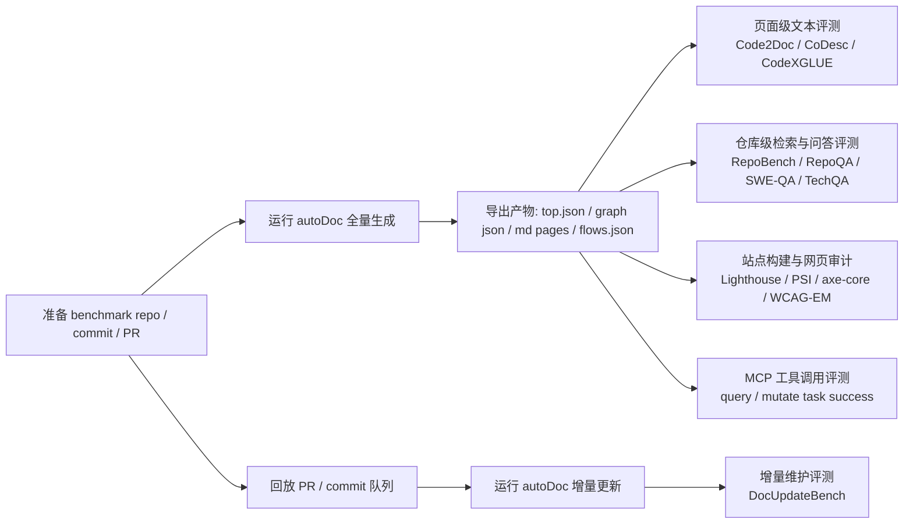
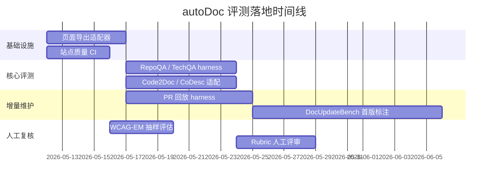

# autoDoc 文档站生成代理的公开基准研究报告

## 执行摘要

[Haruhiko-Joe/autoDoc](https://github.com/Haruhiko-Joe/autoDoc) 不是一个“单函数注释生成器”，而是一个仓库级、多代理、可增量维护、可供 Agent 直接读写的文档站生成系统：它以 Git URL 为入口，经过 Scaffold / Decomposer / Writer / Checker / Flow Analyzer / PrUpdater 等角色协作，产出分层图结构、叶子 Markdown 页面、交互流程图、MCP 查询/修改接口，并支持 PR 驱动的增量更新与多语言输出。

因此，评测 autoDoc 不能只用传统“代码摘要”基准。现有公开 benchmark 大致分成五类：函数/方法级文档生成，仓库级代码理解与检索，文档/技术支持 QA，仓库级增量开发/变更处理，以及工业界网页质量审计。最重要的结论是：**目前没有一个公开单一基准，能同时覆盖内容正确性、覆盖度、信息架构、站内检索、API 参考质量、增量更新、网页性能、SEO、可访问性、以及 Agent 可消费性**。公开生态是碎片化的，必须组合评测。

对 autoDoc 最合适的方案不是“找一个 benchmark”，而是构造一个 **组合评测栈**：
**Code2Doc / CoDesc / CodeSearchNet-CodeXGLUE** 负责页面级文本质量，**RepoBench / RepoQA / SWE-QA / LongCodeBench** 负责仓库级理解、检索与长上下文导航，**TechQA** 负责“文档能否回答真实技术问题”，**Lighthouse + PageSpeed Insights/CrUX + axe-core + WCAG-EM** 负责站点质量，**FEA-Bench / SWE-bench 思路改造出的 DocUpdateBench** 负责 PR 增量更新。

如果目标是**尽快、可落地地评估 autoDoc**，我建议优先做三层：
第一层，用 **Lighthouse / axe-core / PSI** 把产出站点的性能、SEO、可访问性与 Core Web Vitals 固化到 CI；第二层，用 **RepoQA + TechQA + 自定义 doc-grounded QA** 测“文档站是否真的可找、可问、可答”；第三层，用 **自定义 PR 回放评测** 测增量更新是否跟得上代码变化。函数级文档生成 benchmark 仍有价值，但只应作为子分项，而不是总代表分。

## autoDoc 的被评测对象分解

从仓库公开说明可以看出，autoDoc 的核心产物不是单个摘要，而是一个**文档站系统**：顶层 `top.json`、子图 JSON、叶子 Markdown、`flows.json`、前端可视化页面、侧边搜索、AI chat 面板，以及同进程暴露的 HTTP MCP；它还把生成结果保存在 `src/souko/doc/{project}/` 下，并支持基于 `gh pr list` / `git log` 的增量重写。

这意味着 autoDoc 的评测对象至少拆成六个维度：
**内容层**：页面是否正确、完整、可读、是否包含足够上下文与代码引用；
**结构层**：模块划分、层次深度、边关系、流程图与导航是否符合仓库真实结构；
**检索层**：用户或 Agent 能否通过搜索、图钻取、MCP 工具快速找到信息；
**维护层**：PR 合入后文档是否仅做必要更新，是否会遗漏、漂移或引入陈旧引用；
**站点层**：性能、CWV、SEO、可访问性与前端最佳实践；
**Agent 层**：MCP 提供的 `get_top / get_graph / get_page / search_nodes / patch_page / update_page` 等工具，是否能让外部代码代理稳定消费与维护文档。

换句话说，autoDoc 的“正确答案”不是一段参考注释，而是：**一个能被人类阅读、能被 Agent 查询、能被 PR 驱动持续维护、并且具备可用站点质量的文档知识库**。这也是为什么现有 benchmark 需要组合使用，而不能只看 BLEU/ROUGE。

## 公开基准与评测套件盘点

下表按“直接相关”与“邻近但有用”汇总目前公开、且对 autoDoc 有实际评测价值的 benchmark / dataset / leaderboard / audit suite。表中“版本”只列在公开主源中能明确确认的版本或公开变体；无法从已收集主源确认的，不强行补写。

| 基准 / 套件 | 公开版本 / 变体 | 主要对象 | 数据组成 | 指标 / 方法 | 典型基线 / 公开提交 | 对 autoDoc 的相关性 |
|---|---|---|---|---|---|---|
| **CodeSearchNet Corpus / Challenge** | 2019 Corpus + Challenge | 代码搜索、代码-文档对齐 | 约 600 万函数，约 200 万带文档函数；Challenge 含 99 个自然语言查询与约 4k 专家相关性标注 | 排序式代码搜索评测；官方 challenge 有 leaderboard；已收集摘要未展开全部公式细节 | 官方 challenge、简单基线与后续社区 leaderboard | **高**：可测“站内搜索 / query→code/doc 定位能力” CodeSearchNet Challenge 论文 / GitHub Blog 发布 |
| **CodeXGLUE** | 2021 | 代码理解/生成综合套件 | 10 任务、14 数据集；覆盖 code summarization、code search、documentation translation 等 | 官方 leaderboard；各任务用官方 task repo 评测方法；code summarization 是核心子任务之一 | BERT-style、GPT-style、Encoder-Decoder 三类基线 | **高**：适合作为函数/页面级文本质量与搜索子任务入口 CodeXGLUE 官网 / CodeXGLUE GitHub / CodeXGLUE 论文 |
| **FunCom** | Raw / Filtered / Tokenized 三种公开下载形态 | Java 方法摘要 / 文档一句话总结 | Raw: 51,841,717 methods；Filtered/Tokenized: 2,149,121 method-comment pairs；来自 28k+ Java 项目 | 原始论文强调数据集设计标准化；后续研究大量用 BLEU 类指标，但官方统一 leaderboard 不强 | 原论文与后续 summarization baselines | **中高**：适合 leaf-page 摘要质量子测，不适合站点级评测 FunCom 基准论文 / NAACL 论文 PDF 摘要页 |
| **TL-CodeSum / TLC** | 原始 TL-CodeSum；ICSE2022 复现实验常用 TLC split | Java 代码摘要 | 原始 IJCAI 2018 使用 Java 工业项目；ICSE2022 复现包给出常用 split：69,708 train / 8,714 valid / 8,714 test | 原始工作比较代码摘要性能；后续复现实验显示 BLEU 变体与预处理差异会显著改变结果 | TL-CodeSum 自身、后续多种 seq2seq / AST / graph baselines | **中**：可测段落级说明是否“像摘要”；对结构/导航无覆盖 TL-CodeSum 论文 / CodeSumEvaluation 复现包 |
| **CoDesc** | 2021 初始公开版 | 大规模 code-description 对齐；同时支持 summarization 与 code search | 420 万 Java method-description pairs，整合并去噪 CodeSearchNet / FunCom / DeepCom / CONCODE | 同时用于 code summarization 与 code search；论文报告可提升 code search，并刷新 summarization SOTA | 论文中比较默认数据训练与 CoDesc、预训练-微调设置 | **高**：很适合评测 autoDoc 生成的 API/函数页描述质量与检索相关性 CoDesc 论文 / CoDesc GitHub |
| **Code2Doc** | 2025 初始公开版 | 高质量函数级文档生成 | 13,358 高质量函数-文档对，5 种语言；从 52,069 候选中筛到 25.6% | 论文公开使用 BLEU、ROUGE-L 等并强调质量控制；平均文档质量 6.93/10 | zero-shot vs fine-tuned LLM baseline | **很高**：比旧数据集更适合“现代高质量文档生成”的 sanity check Code2Doc 论文 |
| **APIBench** | Zenodo v1.0（2021）；v2（2023） | API 推荐 | Query-based 与 code-based 两子集；Java / Python 版本；v2 为较新公开记录 | 用于 API recommendation，而非整站文档生成 | API 推荐方法基线 | **中低**：仅对 autoDoc 的 API 参考、端点可发现性有间接价值 APIBench v1.0 / APIBench v2 |
| **TechQA** | 2020 | 技术文档问答 / support QA | 600 train / 310 dev / 490 eval QA；配套 801,998 IBM Technotes 文档集合 | 文档检索 + 阅读理解式 QA；强调真实论坛问题与技术文档结合 | 论文给出跨任务跨域迁移基线 | **很高**：最接近“生成的文档站能否回答真实技术问题” TechQA 数据集页面 / TechQA 跨任务论文 |
| **RepoBench** | 初始 paper 版；v1.1（2024） | 仓库级补全 / 代码检索 | Python 与 Java；三种 setting：cross_file_first / cross_file_random / in_file | 官方脚本算 EM、Edit Similarity、CodeBLEU | README 提供基本运行与评测脚本 | **很高**：可改造为“autoDoc 是否把跨文件关系与上下文表述到位” RepoBench 论文 / RepoBench GitHub v1.1 |
| **RepoQA** | 2024 初始公开版 | 长上下文仓库代码理解 / 检索 | 500 tests = 5 语言 × 10 repos × 10 needle functions | Search Needle Function；默认阈值 0.8；若输出函数与真值语法上最接近则通过 | 官方 CLI 支持 OpenAI/Anthropic/vLLM/HF | **极高**：直接评测“文档站/MCP 是否帮助定位正确模块与函数” RepoQA 论文 / RepoQA GitHub |
| **LongCodeBench** | 2025 初始公开版 | 百万上下文代码理解与修复 | 两个子任务：LongCodeQA 与 LongSWEBench；利用真实 GitHub issues 构造 | QA 子任务报告 accuracy；修复子任务走 SWE-bench harness 风格；按不同上下文长度分层 | 多模型在不同 context size 上 benchmark | **很高**：适合 autoDoc 的大仓库、长上下文、跨文件导航能力 LongCodeBench OpenReview / LongCodeBench GitHub |
| **SWE-QA** | 2025 arXiv 版；2026 ARR/OpenReview 修订版 | 仓库级问题回答 | arXiv 版：576 QA、11 repos；ARR 修订版：720 QA、12 repos | 关注 intention understanding / cross-file reasoning / multi-hop dependency；已收集摘要未完全展开官方评分公式 | 论文另给 SWE-QA-Agent 原型 | **高**：很适合 autoDoc 的“文档问答 + 仓库语义导航”评测 SWE-QA arXiv 摘要页 / SWE-QA OpenReview 修订版 / SWE-QA 代码链接说明 |
| **FEA-Bench** | v1.0；Standard / Oracle / Lite-Standard / Lite-Oracle | 仓库级新功能实现 / 增量开发 | 1,401 tasks，83 GitHub repos；来自真实 PR；附单测 | 复用 SWE-bench harness，最终以 resolved / unresolved instances 等统计；GitHub / HF 提供数据变体 | 论文与官方 repo 提供 prompt 对齐 baseline | **高但间接**：非常适合改造成“PR→文档增量更新”评测框架 FEA-Bench 论文 / FEA-Bench GitHub / FEA-Bench 数据卡 |
| **SWE-bench** | SWE-bench；Lite；Verified；Multimodal | 真实 GitHub issue 修复 | 官方 repo 与网站均公开；Verified 为 500 题人工确认可解子集 | patch 是否解决 issue；容器化 harness；公开 leaderboard | SWE-agent、SWE-Llama 等公开结果 | **中高**：不是文档 benchmark，但其 harness 与实例组织方式很适合生成 DocUpdateBench SWE-bench GitHub / SWE-bench 网站仓库 |
| **Lighthouse / Lighthouse CI** | 文档显式给出 v8、v10 评分变化；GitHub 最新为 v13.3.0 | 网页性能 / 可访问性 / Best Practices / SEO | 任意 URL；可本地、CLI、Node、PSI 跑 | Performance: 指标加权；v10 权重 FCP 10 / SI 10 / LCP 25 / TBT 30 / CLS 25；Accessibility 分数基于 axe 用户影响权重 | 官方支持 DevTools、CLI、CI | **极高**：autoDoc 作为文档站，必须纳入 CI 主指标 Lighthouse 总览 / Performance Scoring / Accessibility Scoring / GitHub Releases |
| **PageSpeed Insights API v5 + CrUX / Web Vitals** | PSI API v5；当前 CWV 为 LCP/INP/CLS | 真机用户体验 + 实验室评测 | 真实用户 28 天 field data + Lighthouse lab data | 75 分位；阈值：LCP 2.5s / INP 200ms / CLS 0.1 为 good；PSI 还给 FCP、TTFB 等 | 官方 API / Explorer | **极高**：能把 autoDoc 站点质量转成程序化可回归指标 PSI About / PSI API 入门 / runPagespeed 方法 / Web Vitals 官方文档 |
| **axe-core** | 官方规则库；支持 WCAG 2.0 / 2.1 / 2.2 | 自动化网页可访问性 | 规则引擎，输出 violations / passes / incomplete / inapplicable，带规则 tag | 自动检查 HTML 渲染内容；可嵌入测试基础设施 | Lighthouse 也引用其规则体系与用户影响权重 | **极高**：文档站 a11y 必备；对 Agent 也有帮助，因为完整无障碍树会提升可机器理解性 axe-core 官方页 / axe API 文档 / Lighthouse agent accessibility 文档 |
| **WCAG-EM / Report Tool** | WCAG-EM 1.0；2.0 draft；Report Tool v3.0.3 | 人工/半人工站点可访问性合规评估 | 不是数据集，而是正式方法论：定义范围、探索、采样、评估、报告 | 代表性页面采样与结构化报告，而非单页打分 | W3C 官方工具与模板 | **高**：适合作为 autoDoc 发布前人工抽样复核流程 WCAG-EM Overview / WCAG-EM Report Tool / W3C Conformance Evaluation 页面 |

### 关键补充观察

代码摘要领域长期存在“**同一模型在不同数据预处理、去重、BLEU 变体下可出现显著结果摆动**”的问题；LeClair & McMillan 在数据集论文中直接指出，光是数据集设计变化就可能带来超过 33% 的性能波动，而 ICSE 2022 的复现包则把 12 个原始/处理后数据集、6 种 BLEU 实现与多种预处理操作显式整理出来。对 autoDoc 而言，这意味着**如果你只用 BLEU/ROUGE 比较页面文字质量，很容易高估或低估系统能力**。

从仓库级 benchmark 侧看，RepoBench、RepoQA、LongCodeBench、SWE-QA、FEA-Bench、SWE-bench 都在强调一个共同结论：**真实软件工程能力的难点不在“生成一句对的注释”，而在跨文件、跨模块、长上下文、增量变更和检索-推理闭环**。这恰好与 autoDoc 的目标函数更一致。

## 维度覆盖与空白

下表把各 benchmark 映射到 autoDoc 真正关心的评测维度。符号含义：**● 直接覆盖**，**◐ 部分覆盖**，**○ 基本不覆盖**。这是基于各 benchmark 官方任务定义与公开说明做的归纳映射。

| 基准 | 内容正确性 | 覆盖/完整性 | 结构/导航 | 搜索/QA | API参考/工具可用性 | 增量更新 | 站点性能/SEO/a11y | 人工主观可读性 |
|---|---:|---:|---:|---:|---:|---:|---:|---:|
| CodeSearchNet / CodeXGLUE | ◐ | ○ | ○ | ● | ◐ | ○ | ○ | ◐ |
| FunCom / TL-CodeSum / CoDesc / Code2Doc | ● | ◐ | ○ | ○ | ◐ | ○ | ○ | ◐ |
| APIBench | ◐ | ○ | ○ | ◐ | ● | ○ | ○ | ○ |
| TechQA | ● | ◐ | ◐ | ● | ○ | ○ | ○ | ◐ |
| RepoBench | ◐ | ◐ | ● | ● | ○ | ○ | ○ | ○ |
| RepoQA | ◐ | ◐ | ● | ● | ○ | ○ | ○ | ○ |
| LongCodeBench | ● | ◐ | ● | ● | ○ | ◐ | ○ | ○ |
| SWE-QA | ● | ◐ | ● | ● | ○ | ○ | ○ | ◐ |
| FEA-Bench / SWE-bench | ◐ | ◐ | ◐ | ◐ | ○ | ● | ○ | ○ |
| Lighthouse / PSI / CrUX | ○ | ○ | ◐ | ◐ | ○ | ○ | ● | ◐ |
| axe-core / WCAG-EM | ○ | ○ | ◐ | ◐ | ○ | ○ | ● | ◐ |

这个矩阵有三个非常关键的洞。第一，**没有公开 benchmark 直接评价“图结构 + 分层页面 + 流程图”这类文档站信息架构是否正确**；RepoBench/RepoQA/SWE-QA 只是在“仓库理解”层面间接接近它。第二，**没有成熟公开 benchmark 专门测 PR 驱动的文档增量更新**；FEA-Bench/SWE-bench 提供了最好用的任务组织与 harness 思路，但目标仍是代码补丁，不是文档补丁。第三，**网页质量套件很强，但它们不判断文档语义内容是否真实、完整、不断裂**。

还有一个容易被忽视的空白是“**陈旧文档检测**”。公开研究已经表明，大量软件仓库会在历史中出现过期代码引用，并且可以通过自动扫描检测出来；这类能力很适合补成 autoDoc 的一项自定义 regression metric，因为它直接对应你的增量维护目标。

## 对 autoDoc 的推荐评测组合

### 最推荐的组合

如果目标是“对 autoDoc 做严肃、可复现、工程上能执行的总评”，我建议使用下列五层组合。这个组合既覆盖 autoDoc 的公开功能面，也避免把系统误降维成单一 code summarizer。

**页面级内容层**：用 **Code2Doc + CoDesc + CodeSearchNet/CodeXGLUE 的 code summarization 子任务**。
原因：Code2Doc 更强调高质量标注、去重与低 AI 污染；CoDesc 更大，更适合看规模化训练/迁移后的稳健性；CodeXGLUE 则提供官方 leaderboard 语境。这里测的是 leaf 页面或 API/函数小节的“局部文本质量”，不是整站能力。

**仓库结构与导航层**：用 **RepoBench + RepoQA + SWE-QA**。
原因：RepoBench 测跨文件依赖和检索-完成闭环，RepoQA 测“从自然语言描述准确找到函数”，SWE-QA 测多跳问题回答与仓库级推理。对 autoDoc 来说，这一层其实比 BLEU 重要，因为用户阅读文档站的首要问题常常不是句子是否优雅，而是**能否快速定位正确模块与正确解释**。

**文档问答层**：用 **TechQA + 自建 doc-grounded QA**。
原因：TechQA 是少数真正接近“技术文档回答真实用户问题”的公开基准；但它的语料是 IBM Technotes，不是代码库文档站，因此必须补一个 autoDoc 专用 QA 集：从生成页面、`flows.json` 和图结构中抽取问题，要求回答时同时给出 page/node grounding。

**增量维护层**：以 **FEA-Bench / SWE-bench** 为骨架，做 **DocUpdateBench**。
原因：这是 autoDoc 最差异化的能力之一。官方说明里，incremental update 是基于 PR 或 commit 队列，由 PrUpdater 通过 MCP `get_top → search_nodes → get_page → patch_page` 逐项修改。公开 benchmark 中没有现成的文档版任务，因此最合理做法是借 FEA-Bench / SWE-bench 的实例组织、容器化回放与 resolved-rate 思路，改成“给定 PR diff，文档是否正确更新”。

**站点质量层**：用 **Lighthouse + PSI/CrUX + axe-core + WCAG-EM**。
原因：这部分没有替代品，且对 autoDoc 这种前端文档站是硬门槛。至少应把 Lighthouse 性能、Accessibility、Best Practices、SEO 分数，CWV 75 分位表现，以及 axe-core violation 计数放进 CI；发布前对代表性页面做 WCAG-EM 抽样复核。

### 我建议新增的自定义指标

现有 benchmark 无法直接测 autoDoc 的三个独特目标：**信息架构正确性、PR 增量维护、Agent 可消费性**。因此应增加如下自定义 metric。以下指标都可以自动化，且与现有公开研究/工具耦合度高。

| 自定义指标 | 定义 | 目的 | 实现难度 |
|---|---|---|---|
| **Graph Coverage / Precision / Recall** | 把 `top.json` / 子图中节点与边，和静态分析得到的模块/调用/依赖图做匹配 | 测架构图是否失真 | 高 |
| **Navigation Success@k** | 给自然语言问题，要求系统通过图钻取/搜索在 k 步内找到正确 node/page | 测“找得到”而不是“写得像” | 中 |
| **Doc-grounded QA Exactness** | 回答问题时必须给出 page/node grounding；评测答案正确性与 grounding 命中率 | 测文档站是否可问可答 | 中 |
| **PR Delta Coverage** | PR 改动涉及的文件/函数/接口，有多少被增量更新反映到文档 | 测增量维护覆盖率 | 高 |
| **Stale Reference Rate** | 文档中引用了已删除/已迁移代码元素的比例 | 测文档陈旧度 | 中 |
| **Example Executability Rate** | 页面中代码块 / CLI 示例的可执行通过率 | 测“可用文档”而非“漂亮文档” | 中 |
| **MCP Task Success Rate** | 外部 Agent 使用 `get_top / get_graph / search_nodes / get_page / patch_page` 完成任务的成功率 | 测 Agent 可消费性 | 中高 |
| **Multilingual Parity Score** | 中文/英文页面的结构、事实、示例的一致性 | 测多语言输出质量 | 中 |
| **Doc UX Proxy** | 搜索首结果命中率、平均定位步数、页面跳出路径长度 | 测真实使用体验 | 中 |

### 推荐总分结构

如果必须输出一个总分，我建议采用以下配重，而不是把 BLEU 放到中心位置：
**仓库理解与导航 30%**，**页面内容与完整性 25%**，**增量维护 20%**，**站点质量 15%**，**Agent 可消费性 10%**。这种权重更符合 autoDoc 的产品定位，也比“纯 code summarization score”更稳健。

## 落地实施方案

### 评测流水线

下面这条线是最适合 autoDoc 的落地方式：把公开 benchmark 与 autoDoc 的真实产物结构接起来，而不是生硬地把 benchmark input 直接喂给大模型。



### 适配步骤与复杂度

| 任务 | 具体做法 | 依赖现有 autoDoc 能力 | 复杂度 |
|---|---|---|---|
| **页面导出适配器** | 将 `src/souko/doc/{project}` 下的图与 Markdown 展平为 JSONL：`node_id, path, title, md, code_scope, parent, edges` | 现有项目存储结构已具备 | 低 |
| **全文/节点索引器** | 用页面标题、描述、node 名称、`flows.json` 构建检索索引，供 RepoQA/TechQA 样式实验调用 | 现有 `search_nodes`、`get_page`、`get_graph` 已支持 | 低 |
| **函数级对齐器** | 对接 Code2Doc/CoDesc/CodeXGLUE：把基准中的函数或 API 片段映射为 autoDoc 的 leaf-page / section 输出 | 需要新增 snippet→page 对齐逻辑 | 中 |
| **站点质量 CI** | 本地起站点，对代表性 URL 执行 Lighthouse CLI、PSI API、axe-core，记录 JSON 并设阈值门禁 | autoDoc 已有 Vue 前端 | 低 |
| **Doc-grounded QA harness** | 题目输入 → 检索 page/node → 回答 + grounding；按 exactness / grounding success / step count 计分 | 可直接用 MCP 工具链 | 中 |
| **PR 回放 harness** | 选 benchmark repo 与 PR，先跑全量，再逐 PR 调 `update/start`，比对文档 diff 与 golden assertions | autoDoc 已有 Update Queue 语义 | 中高 |
| **DocUpdateBench 构建** | 从真实 PR 中人工/半自动标注“哪些页面应改、哪些不应改、应新增哪些节点/流程” | 现有公开 benchmark 无现成文档金标 | 高 |
| **人工抽样评审** | 每个版本抽样看可读性、结构合理性、示例可执行性、多语言一致性 | 需要 rubric 与标注流程 | 中 |

### 建议的数据格式

为了统一多类 benchmark，我建议把 autoDoc 评测中间格式固定成三种 JSONL。这样可以同时接页级、站级、PR 级评测。

**PageRecord**
```json
{
 "repo": "owner/repo",
 "commit": "sha",
 "node_id": "Module.Submodule.Page",
 "title": "xxx",
 "markdown": "...",
 "code_scope": ["src/a.ts", "src/b.ts"],
 "edges": [{"type": "calls", "to": "Y"}],
 "lang": "zh-CN"
}
```

**QATask**
```json
{
 "repo": "owner/repo",
 "commit": "sha",
 "question": "How does incremental update discover merged PRs?",
 "gold_answer": "...",
 "gold_nodes": ["updateOrchestrator", "prDiscovery"],
 "allowed_sources": ["docs", "graph", "flows", "code"]
}
```

**PRUpdateTask**
```json
{
 "repo": "owner/repo",
 "base_commit": "sha1",
 "pr_number": 123,
 "head_commit": "sha2",
 "changed_files": ["src/foo.py", "docs/bar.md"],
 "expected_impacted_nodes": ["Auth", "Token Refresh"],
 "must_change_pages": ["Auth/Refresh.md"],
 "must_not_change_pages": ["CLI/Install.md"]
}
```

### 建议的时间线



### 最小可行评测集

如果你现在就要开始，而不是先建完整 benchmark，我建议按这个顺序上线：

先做 **Lighthouse + PSI + axe-core**，因为这是最低成本、最稳定、最能立即暴露产品问题的一层。

然后做 **RepoQA 风格 + TechQA 风格 QA 流**，这能直接衡量文档站/MCP 是否真的让人和 Agent 更快找到答案。

再做 **PR 回放 + Stale Reference Rate**，因为这才是 autoDoc 相比一般“AI 写文档”工具最有差异化的能力。

最后再补 **Code2Doc / CoDesc / CodeXGLUE** 等页级文本 benchmark，把“写得是否像高质量文档”补齐。

## 开放问题与局限

第一，旧一代代码摘要 benchmark 的**评测协议并不统一**。FunCom、TL-CodeSum、部分 CodeSearchNet 衍生任务在社区中常被用不同 BLEU 变体、不同去重和不同 split 重复使用；这会导致你看到的“数字”不一定可横向比较。

第二，我在已收集主源中**无法为每一个旧 benchmark 都提取到完整且统一格式的“精确评分公式”**；例如某些 challenge 的排序指标、某些 QA benchmark 的最终 judge protocol，在搜索结果摘要中没有完全展开。对这些项，我在表中已明确标成“未完全展开”而没有假装补全。

第三，公开生态中我**没有找到一个端到端 benchmark**，能同时测：仓库理解、图结构正确性、页面文本质量、站内检索、MCP/Agent 可消费性、PR 增量更新、SEO、性能与可访问性。这不是 autoDoc 的问题，而是当前公开 benchmark 生态本身尚未形成统一标准。对 autoDoc 来说，最合理路线就是：**公开 benchmark 组合 + 自定义 DocUpdateBench + 自定义 Graph/QA 指标**。